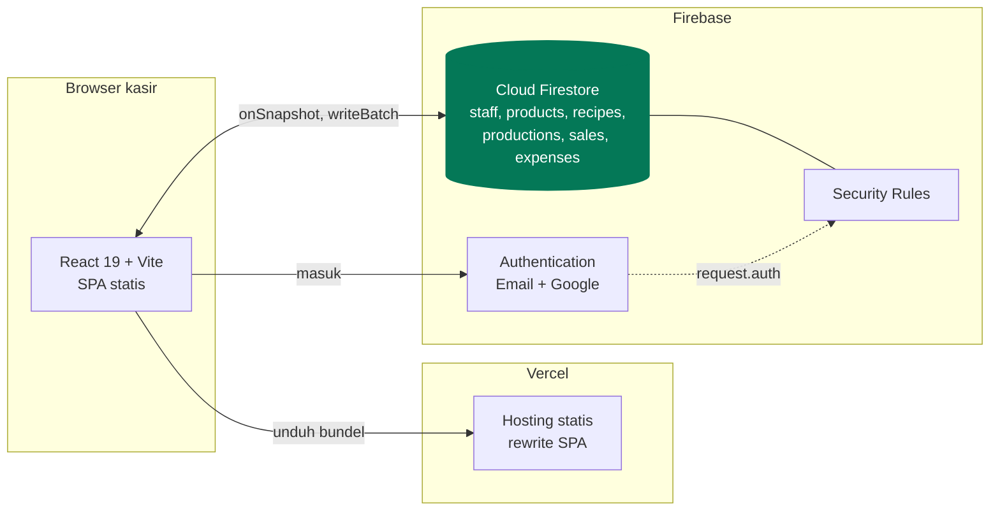

# Dokumentasi Teknis Warungku POS

Dokumentasi rancangan dan cara kerja aplikasi kasir untuk UMKM ini. Ditujukan
untuk pengembang yang akan meneruskan, mengaudit, atau memperbaiki proyeknya.

Semua diagram ditulis dengan [Mermaid](https://mermaid.js.org) dan langsung
tergambar di GitHub, GitLab, VS Code, dan Obsidian tanpa perkakas tambahan.

## Peta dokumen

| Dokumen | Isi | Baca kalau ingin tahu |
| --- | --- | --- |
| [Arsitektur](./arsitektur.md) | Konteks sistem, lapisan kode, topologi deployment, alur data real time | Bentuk besar sistemnya seperti apa dan kenapa tanpa backend |
| [Model Data](./model-data.md) | ERD, skema tiap koleksi, contoh dokumen, alasan denormalisasi | Data disimpan seperti apa di Firestore |
| [Autentikasi & Otorisasi](./autentikasi.md) | Sequence login, gerbang staf, penjagaan rute, state sesi | Siapa boleh masuk dan bagaimana dijaga |
| [Produksi & HPP](./produksi.md) | Bahan baku vs barang jadi, resep, konversi satuan, alur produksi | Bagaimana harga pokok produk olahan dihitung |
| [Alur Kasir](./alur-kasir.md) | Flowchart transaksi, penulisan batch, perilaku offline, pembatalan | Bagaimana satu penjualan diproses dari klik sampai struk |
| [Akuntansi](./akuntansi.md) | Rumus laba rugi, pengakuan HPP, contoh perhitungan | Angka laporan datang dari mana |
| [Frontend](./frontend.md) | Struktur folder, kerangka layout, token desain, cara menambah halaman | Cara mengubah tampilan tanpa merusak konsistensi |
| [Keamanan](./keamanan.md) | Model ancaman, pembedahan Security Rules, matriks izin | Apa yang melindungi data dan apa yang tidak |
| [Operasional](./operasional.md) | Penyiapan, seeding, deploy, penelusuran masalah | Cara menjalankan dan merawatnya |

## Ringkasan satu layar

Tidak ada server aplikasi. Seluruh logika bisnis berjalan di browser, dan yang
menjaga data adalah Firestore Security Rules. Alasannya dijelaskan di
[Arsitektur](./arsitektur.md#kenapa-tanpa-backend).

## Konvensi dokumen

- Angka rupiah ditulis penuh tanpa desimal, sama seperti di kode.
- Nama koleksi, field, dan berkas ditulis dengan `monospace`.
- Diagram sequence memakai nama modul asli, bukan nama konseptual, supaya bisa
  langsung dicari di kode.
- Keputusan rancangan yang punya alasan diberi tanda **Kenapa begitu**. Jangan
  membalik keputusan itu tanpa alasan baru.

## Dokumen terkait di luar folder ini

- [`../README.md`](../README.md) untuk penyiapan awal dan cara pakai harian.
- [`../CLAUDE.md`](../CLAUDE.md) untuk aturan kerja saat mengubah kode.
- [`../firestore.rules`](../firestore.rules) adalah sumber kebenaran keamanan.
