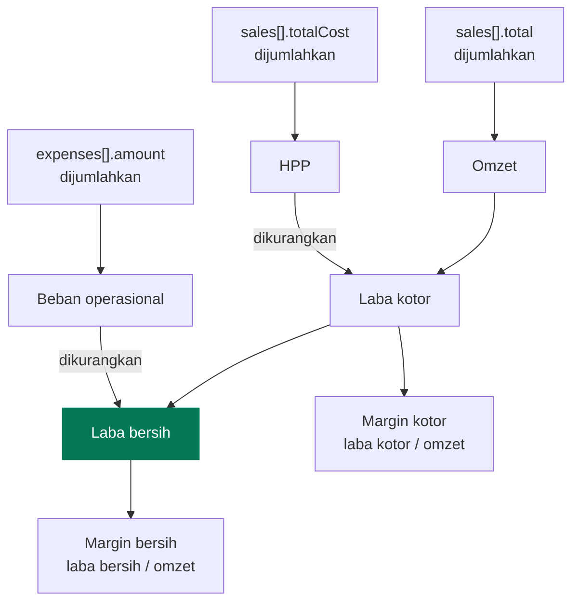
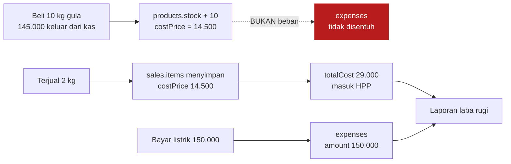
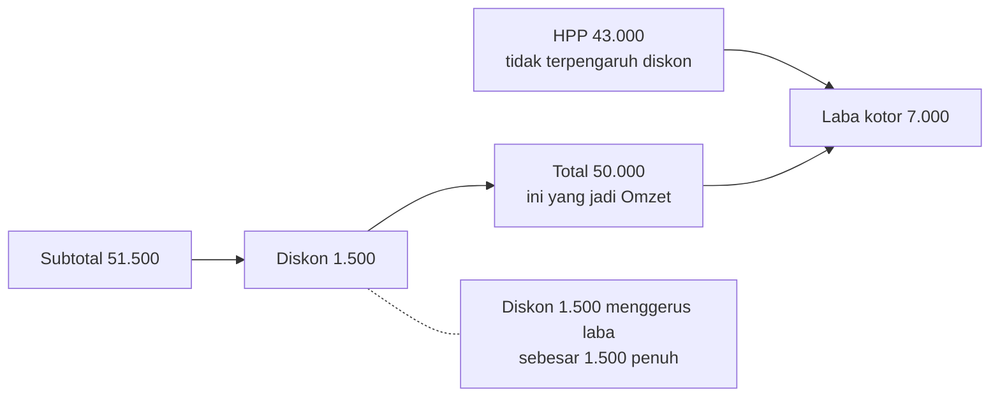
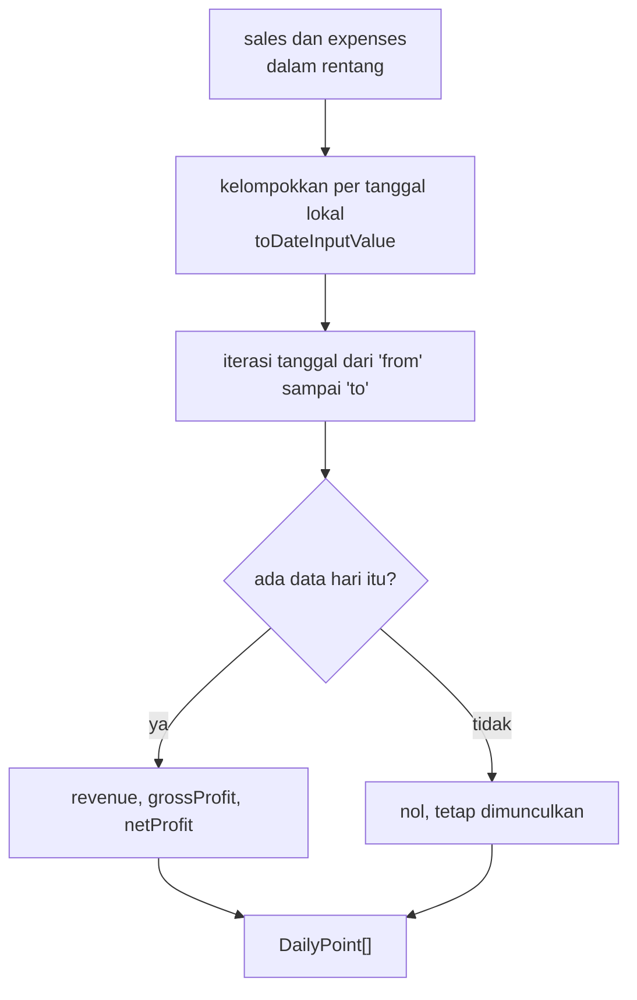
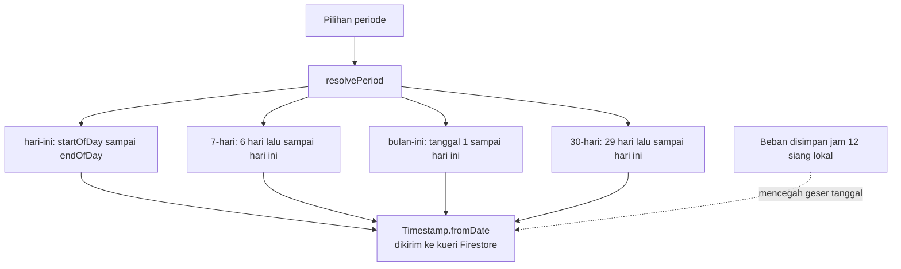

# Akuntansi

[← Kembali ke indeks](./README.md)

Seluruh rumus ada di satu berkas: [`src/lib/profit.ts`](../src/lib/profit.ts).
Jangan menghitung ulang di komponen. Kalau ada dua tempat menghitung laba, cepat
atau lambat keduanya akan berbeda.

## Rumus

```
Omzet        = jumlah total seluruh struk, sudah dipotong diskon
HPP          = jumlah harga modal barang yang terjual
Laba kotor   = Omzet - HPP
Beban        = pengeluaran operasional pada periode yang sama
Laba bersih  = Laba kotor - Beban
```



## Kapan modal barang diakui

Ini inti seluruh pembukuan aplikasi ini, dan tempat kesalahan paling mahal
biasanya terjadi.



**Modal barang diakui saat barang TERJUAL, bukan saat dibeli.**

Kalau pembelian stok juga dicatat sebagai beban, modalnya terhitung dua kali:
sekali sebagai beban saat kulakan, sekali lagi sebagai HPP saat terjual. Laporan
akan menunjukkan rugi padahal warungnya untung.

### Contoh kesalahan yang dicegah

Misal beli 10 kg gula seharga 145.000, lalu bulan itu terjual 2 kg.

| Cara pencatatan | Omzet | HPP | Beban | Laba bersih |
| --- | --- | --- | --- | --- |
| **Benar** | 34.000 | 29.000 | 0 | **5.000** |
| Salah, kulakan jadi beban | 34.000 | 29.000 | 145.000 | **-140.000** |

Baris kedua membuat pemilik warung mengira dagangannya rugi besar, padahal
sisa 8 kg masih ada wujudnya di rak sebagai persediaan.

Karena itu aplikasi **tidak menyediakan cara mencatat pembelian stok sebagai
beban**. Modal stok masuk lewat halaman Produk & Stok, dan tulisan peringatannya
ditaruh langsung di dalam `StockModal` dan `ExpenseFormModal`, di tempat
kesalahannya akan terjadi.

## Contoh perhitungan lengkap

Anggap satu hari dengan dua transaksi dan satu beban.

**Transaksi 1** `INV-260815-081522`

| Barang | Qty | Modal satuan | Jual satuan | Subtotal | HPP baris |
| --- | --- | --- | --- | --- | --- |
| Gula pasir 1 kg | 2 | 14.500 | 17.000 | 34.000 | 29.000 |
| Mie instan goreng | 5 | 2.800 | 3.500 | 17.500 | 14.000 |
| | | | **Subtotal** | 51.500 | 43.000 |
| | | | **Diskon** | -1.500 | |
| | | | **Total** | **50.000** | **43.000** |

Laba kotor transaksi 1 = 50.000 - 43.000 = **7.000**

**Transaksi 2** `INV-260815-143052`

| Barang | Qty | Modal satuan | Jual satuan | Subtotal | HPP baris |
| --- | --- | --- | --- | --- | --- |
| Minyak goreng 1 liter | 1 | 16.800 | 19.500 | 19.500 | 16.800 |
| Kopi sachet | 4 | 1.300 | 2.000 | 8.000 | 5.200 |
| | | | **Total** | **27.500** | **22.000** |

Laba kotor transaksi 2 = 27.500 - 22.000 = **5.500**

**Beban hari itu**: pembelian plastik dan kantong belanja 8.000.

**Laporan hari itu**

| Baris | Nilai |
| --- | --- |
| Omzet penjualan | 77.500 |
| Harga pokok penjualan | (65.000) |
| **Laba kotor** | **12.500** |
| Beban perlengkapan | (8.000) |
| **Laba bersih** | **4.500** |
| Margin kotor | 16,1% |
| Margin bersih | 5,8% |

Nilai negatif ditampilkan dalam kurung, mengikuti kebiasaan laporan keuangan,
bukan dengan tanda minus.

## Efek diskon

Diskon mengurangi omzet, tidak mengurangi HPP. Modal barang tetap keluar penuh
berapa pun potongan yang diberikan.



Konsekuensi praktis: memberi diskon 10% pada barang bermargin 15% hampir
menghabiskan seluruh untungnya. Itu sebabnya form produk menampilkan margin
secara langsung saat harga diketik.

## Perhitungan turunan

### Deret harian untuk grafik

`buildDailySeries` menghasilkan satu titik per hari **termasuk hari tanpa
transaksi**, bernilai nol.



**Kenapa hari kosong tetap dimunculkan.** Kalau hari tanpa penjualan dilewati,
jarak antar titik di grafik tidak lagi mewakili waktu, dan grafik berbohong:
libur seminggu akan terlihat seperti penjualan yang mulus.

### Peringkat produk

`rankProducts` mengurutkan berdasarkan **kontribusi laba**, bukan jumlah terjual.

```
laba produk = (sellPrice - costPrice) * qty, dijumlahkan lintas transaksi
```

Barang yang laku 100 buah dengan untung 200 rupiah menyumbang 20.000. Barang yang
laku 5 buah dengan untung 8.000 menyumbang 40.000. Yang kedua lebih penting bagi
warung, dan urutan berdasarkan qty akan menyembunyikan fakta itu.

## Zona waktu

Semua pengelompokan periode memakai **waktu lokal perangkat**, bukan UTC.



Warung buka dan tutup menurut jam dinding setempat, bukan UTC. Menyimpan beban
pada jam 12 siang memberi jarak 12 jam ke kedua arah, sehingga pergeseran zona
waktu tidak akan memindahkan catatan ke tanggal sebelah.

## Ekspor CSV

Laporan bisa diunduh dari halaman Laba Rugi.

| Pilihan | Alasan |
| --- | --- |
| Pemisah titik koma, bukan koma | Excel berlokal Indonesia memakai koma sebagai desimal, sehingga koma sebagai pemisah kolom merusak angka |
| Diawali BOM `` | Tanpa itu Excel salah membaca karakter non-ASCII |
| Nilai berisi tanda kutip dilipat gandakan | Aturan pengutipan CSV standar |

Hasilnya bisa dibuka dengan klik ganda tanpa melewati wizard impor.

## Yang tidak dilakukan aplikasi ini

Ini pembukuan warung, bukan sistem akuntansi berpasangan.

| Tidak ada | Konsekuensi |
| --- | --- |
| Jurnal debit kredit | Tidak bisa menghasilkan neraca |
| Akun piutang dan utang | Penjualan kasbon tidak bisa dicatat |
| Penyusutan aset | Etalase dan kulkas tidak masuk hitungan |
| Nilai persediaan akhir di laporan | Nilai stok hanya tampil di halaman Produk & Stok |
| Pajak | Tidak ada perhitungan PPN maupun PPh |
| Periode terkunci | Transaksi lama masih bisa dibatalkan kapan saja |

Kalau salah satu dari ini dibutuhkan, itu tanda usahanya sudah tumbuh melewati
cakupan aplikasi ini, dan sebaiknya pindah ke perangkat lunak akuntansi
sungguhan daripada menambal di sini.
