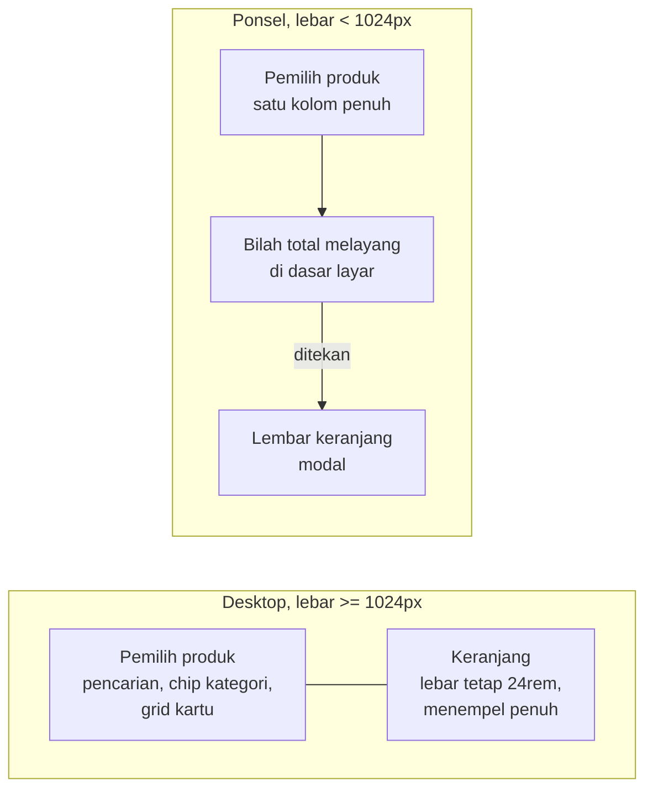
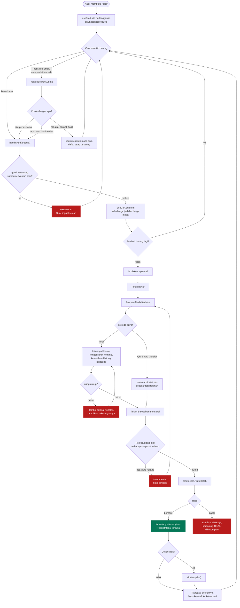
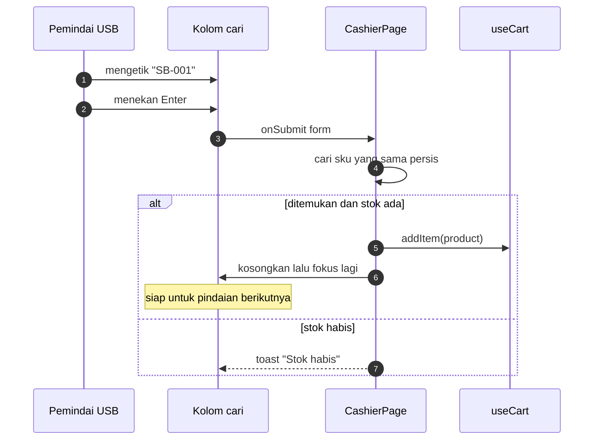
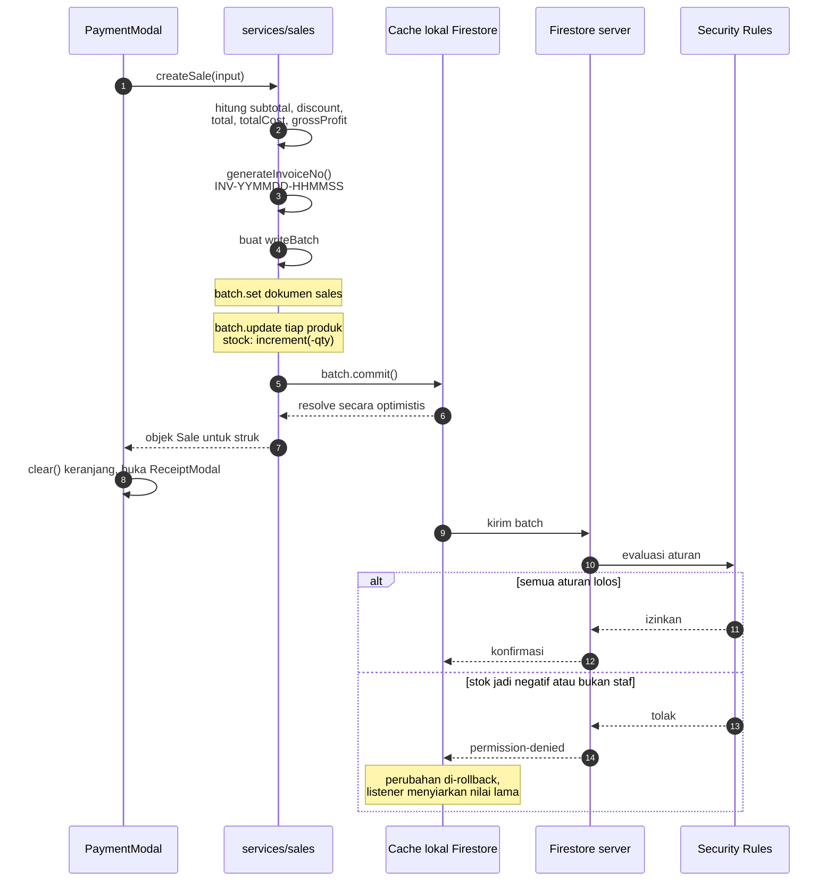
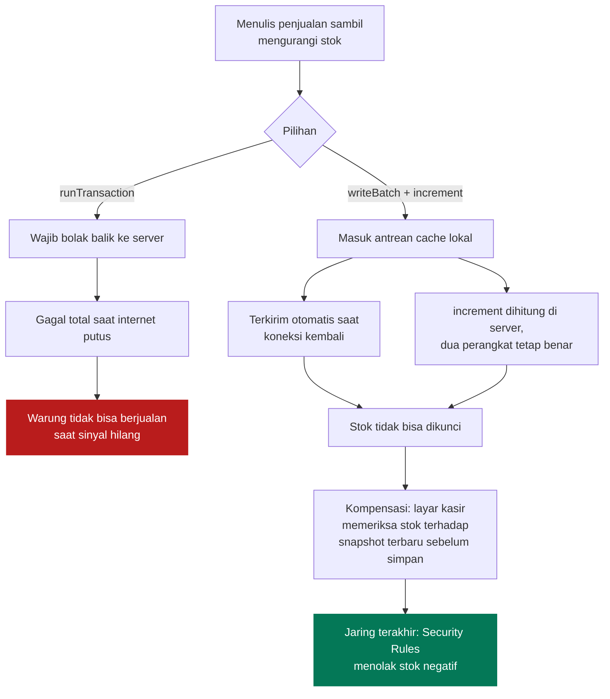
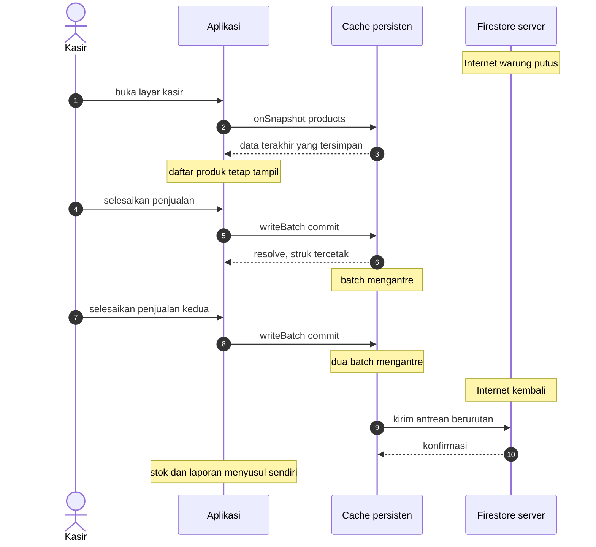
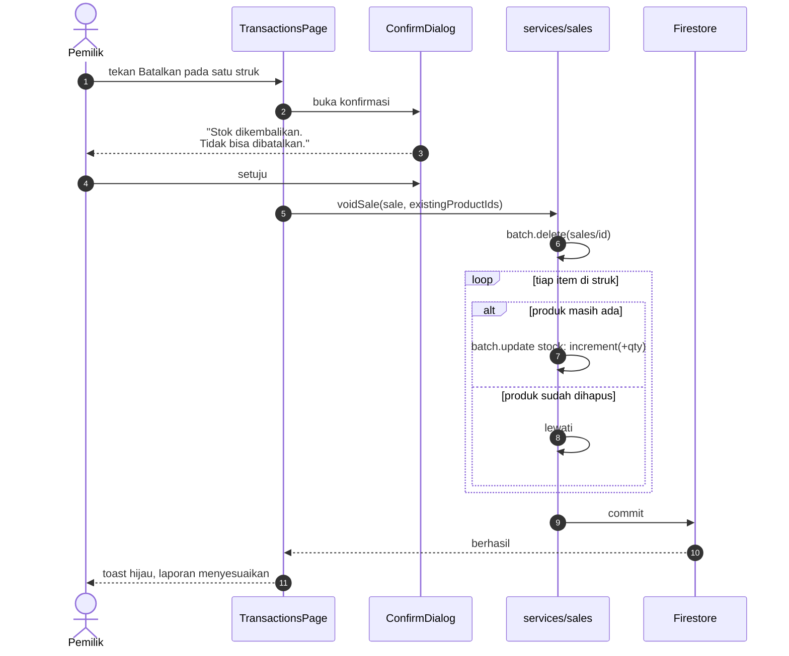
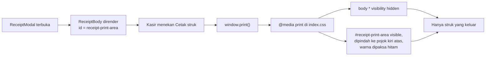
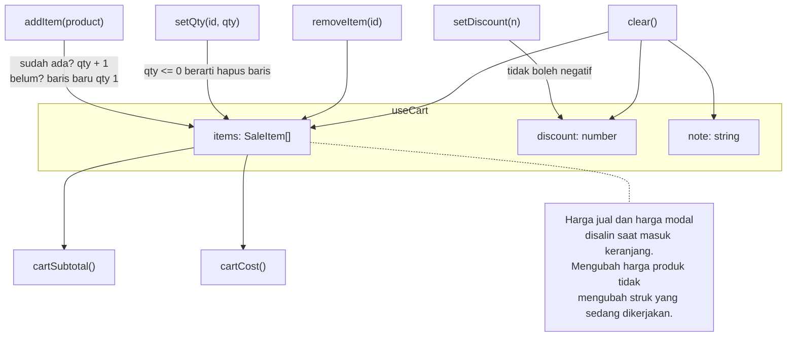

# Alur Kasir

[← Kembali ke indeks](./README.md)

Layar yang paling sering dipakai dan paling tidak boleh gagal. Kodenya tersebar
di [`src/pages/CashierPage.tsx`](../src/pages/CashierPage.tsx),
[`src/features/cashier/`](../src/features/cashier/), dan
[`src/services/sales.ts`](../src/services/sales.ts).

## Tata letak layar

Layar kasir memakai `fullBleed: true` di `navigation.ts`, artinya ia mengatur
tinggi dan scroll sendiri tanpa padding dari kerangka aplikasi.

**Kenapa begitu.** Di ponsel, keranjang yang selalu tampil akan memakan setengah
layar dan menyisakan ruang terlalu sempit untuk memilih barang. Bilah total
melayang menjaga informasi harga tetap terlihat tanpa mengorbankan grid produk.

## Alur satu transaksi

Perhatikan cabang gagal: **keranjang tidak dikosongkan**. Kalau penulisan gagal
lalu keranjang ikut hilang, kasir harus memindai ulang seluruh belanjaan di depan
antrean pembeli.

## Dukungan pemindai barcode

Pemindai barcode USB bekerja sebagai papan ketik: ia mengetik kode lalu menekan
Enter. Tidak ada pustaka khusus yang dibutuhkan.

Kolom pencarian mendapat `autoFocus` dan dikembalikan fokusnya setiap selesai
menambah barang, supaya pemindaian beruntun tidak perlu klik sama sekali.

## Penulisan penjualan

### Kenapa `writeBatch`, bukan `runTransaction`

Ini keputusan paling penting di seluruh berkas ini.

Ringkasnya: **kemampuan berjualan saat offline lebih berharga daripada penguncian
stok yang sempurna**, untuk warung yang biasanya hanya punya satu terminal kasir.

Tiga lapis perlindungan menggantikan penguncian:

1. Tombol tambah nonaktif ketika qty menyentuh stok.
2. Pemeriksaan ulang menyeluruh tepat sebelum `createSale`.
3. Security Rules menolak `stock` yang jadi negatif.

## Perilaku offline

### Batasannya, jujur

| Hal | Perilaku saat offline |
| --- | --- |
| Membaca produk dan riwayat | Berfungsi, dari cache |
| Mencatat penjualan | Berfungsi, mengantre |
| Cetak struk | Berfungsi, tidak butuh jaringan |
| Masuk pertama kali di perangkat baru | **Tidak berfungsi**, butuh jaringan |
| Penolakan Security Rules | Baru diketahui saat sinkron, perubahan **di-rollback diam diam** |
| `createdAt` dari `serverTimestamp` | Sementara bernilai null di cache, transaksi bisa telat muncul di daftar bertanggal |

Baris kedua dari bawah adalah risiko yang sesungguhnya: penjualan yang dibuat
offline oleh akun yang aksesnya dicabut akan hilang tanpa pemberitahuan saat
sinkron. Untuk satu gerai dengan staf tetap, ini dianggap dapat diterima.

## Pembatalan transaksi

Dokumen `sales` **tidak boleh diedit** (`allow update: if false`). Koreksi
dilakukan dengan membatalkan lalu memasukkan ulang.

**Kenapa perlu `existingProductIds`.** `batch.update` ke dokumen yang tidak ada
akan menggagalkan **seluruh** batch. Tanpa penyaringan ini, struk yang memuat
produk yang sudah dihapus akan mustahil dibatalkan. Daftar id diambil dari
snapshot produk yang sedang aktif di halaman.

## Struk dan pencetakan

**Kenapa begitu.** Membuka jendela cetak terpisah sering diblokir sebagai popup
dan merepotkan di printer termal murah yang biasa dipakai warung. Mengisolasi
satu elemen lewat CSS cetak jauh lebih andal dan tidak butuh izin apa pun.

Lebar struk dibuat sempit dengan tipografi monospace supaya mendekati keluaran
printer termal 58 mm.

## State keranjang

Disimpan di zustand, di luar pohon React, agar bilah total di ponsel dan panel
keranjang di desktop membaca sumber yang sama.

