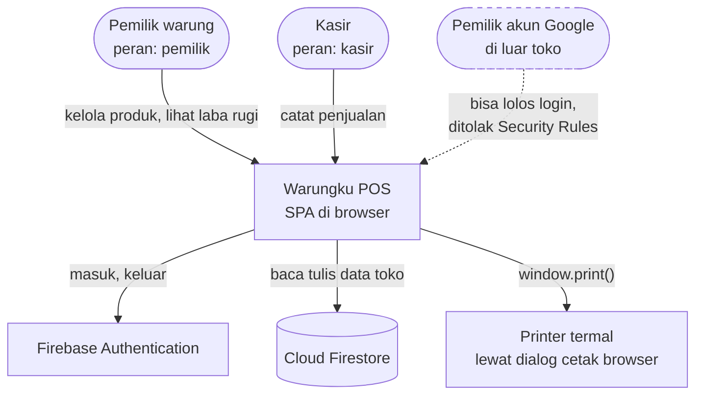
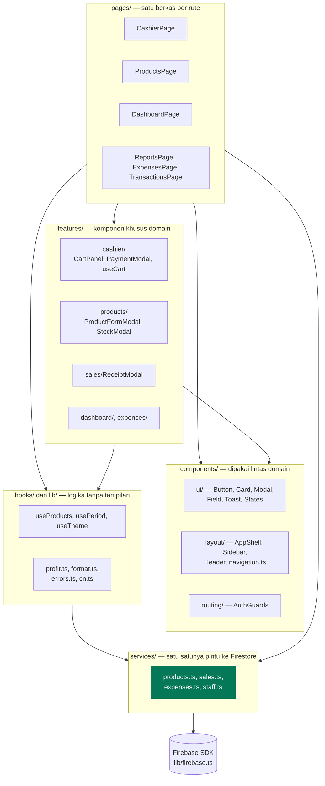
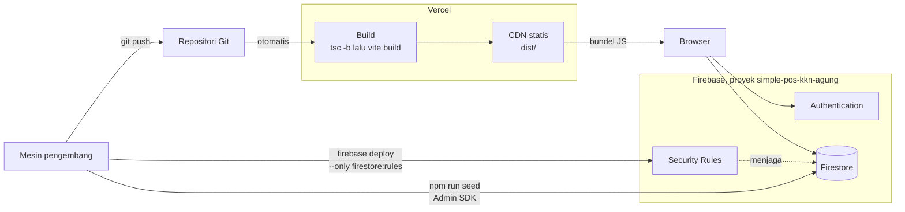
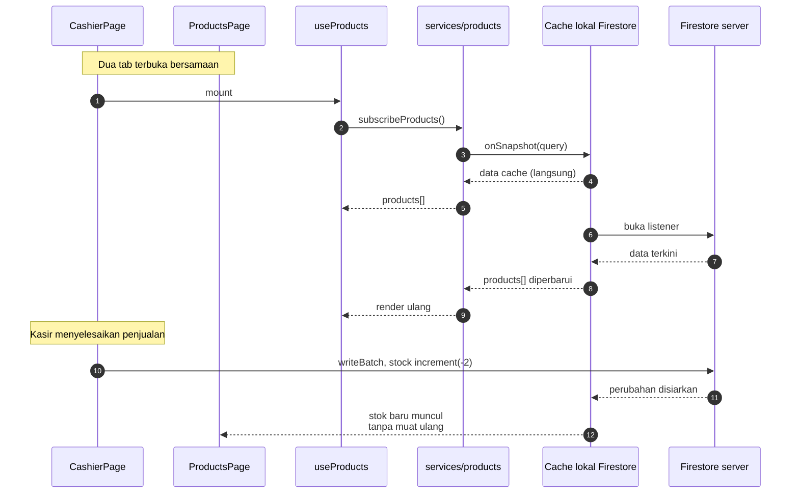
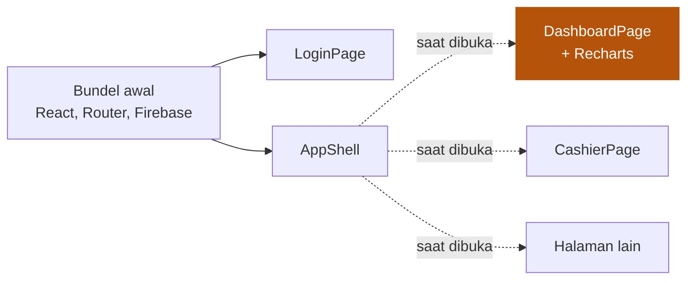

# Arsitektur

[← Kembali ke indeks](./README.md)

## Diagram konteks

Siapa memakai apa, dan sistem luar apa saja yang terlibat.

Garis putus-putus dari orang asing bukan kekeliruan gambar. Sejak Google Sign-In
aktif, siapa pun bisa lolos tahap autentikasi. Yang menahannya adalah lapisan
otorisasi, bukan lapisan login. Detailnya di [Keamanan](./keamanan.md).

## Kenapa tanpa backend

Ini keputusan sadar, bukan penyederhanaan yang tertunda.

| Pertimbangan | Akibatnya |
| --- | --- |
| Proyek kecil untuk satu gerai | Tidak ada beban trafik yang butuh server sendiri |
| Menghindari biaya | Tanpa Vercel Functions, hosting tetap di paket gratis |
| Menghindari Next.js | Tidak ada SSR, tidak ada server action, tidak ada cold start |
| Firestore sudah punya otorisasi | Security Rules menggantikan lapisan API |

**Kenapa begitu.** Menambahkan API route berarti menambah permukaan yang harus
di-deploy, dimonitor, dan dibayar, sementara Firestore Rules sudah memberi
kontrol per dokumen. Konsekuensinya yang harus diterima: seluruh logika bisnis
ada di klien dan bisa dibaca siapa saja, sehingga **tidak boleh ada rahasia di
dalam kode**, dan setiap aturan yang penting harus ikut ditegakkan di Rules.

Yang hilang karena tidak ada backend:

- Tidak bisa menjalankan pekerjaan terjadwal, misalnya tutup buku otomatis.
- Tidak bisa menyembunyikan perhitungan apa pun dari pengguna.
- Validasi hanya sekuat yang bisa ditulis di Security Rules.

## Lapisan kode

### Aturan ketergantungan

1. **Halaman tidak memanggil Firestore langsung.** Semua kueri dan tulisan lewat
   `services/`. Ini yang membuat perubahan skema terlokalisasi di satu folder.
2. **`lib/` tidak mengimpor komponen.** Isinya fungsi murni yang bisa diuji
   tanpa React.
3. **`components/ui/` tidak tahu apa pun soal domain.** Tidak ada kata "produk"
   atau "penjualan" di dalamnya.
4. **`features/` boleh tahu domain**, tapi tidak boleh diimpor oleh `components/ui/`.

Ketergantungan mengalir satu arah, dari atas ke bawah. Kalau ada impor yang
melawan arah, itu tanda logikanya salah tempat.

## Topologi deployment

**Dua jalur deploy yang terpisah.** Vercel hanya mengirim frontend. Perubahan
`firestore.rules` **tidak ikut** ter-deploy lewat Vercel dan harus dikirim
sendiri. Ini sumber kebingungan yang paling sering: aturan diubah di repositori,
di-commit, di-push, tapi Firestore masih memakai aturan lama.

## Alur data real time

Aplikasi tidak memakai pola ambil-lalu-simpan. Semua daftar berlangganan
`onSnapshot`, jadi perubahan di satu layar langsung terlihat di layar lain.

**Kenapa begitu.** Kasir sering membuka layar kasir di satu tab dan laporan di
tab lain. Tanpa langganan real time, angka di dua tab akan berbeda dan pemilik
warung kehilangan kepercayaan pada laporannya.

Cache lokal persisten diaktifkan dengan `persistentMultipleTabManager` agar
beberapa tab berbagi satu cache. Lihat `src/lib/firebase.ts`.

## Pemuatan bundel

Setiap halaman dimuat terpisah lewat `React.lazy`. Recharts hanya ikut terunduh
saat dashboard atau laporan dibuka.

Layar kasir adalah yang paling sering dibuka dan paling butuh cepat, jadi ia
tidak boleh ikut menanggung berat pustaka grafik.

## Rangkuman pilihan teknologi

| Kebutuhan | Pilihan | Alasan singkat |
| --- | --- | --- |
| Kerangka UI | React 19 | Ekosistem matang, tim sudah paham |
| Bundler | Vite 8 | Build cepat, keluaran statis murni |
| Bahasa | TypeScript | Model uang dan stok tidak boleh salah tipe |
| Gaya | Tailwind v4 | Token desain di CSS, tanpa berkas konfigurasi JS |
| Rute | react-router-dom 7 | Rute bersarang cocok dengan kerangka layout |
| State global | zustand | Keranjang dan tema saja, tidak perlu Redux |
| Ikon | Phosphor | Satu keluarga, tidak ada SVG buatan tangan |
| Grafik | Recharts | Cukup untuk dua deret, dimuat terpisah |
| Font | Geist via Fontsource | Di-bundle sendiri, tidak memanggil Google Fonts |
