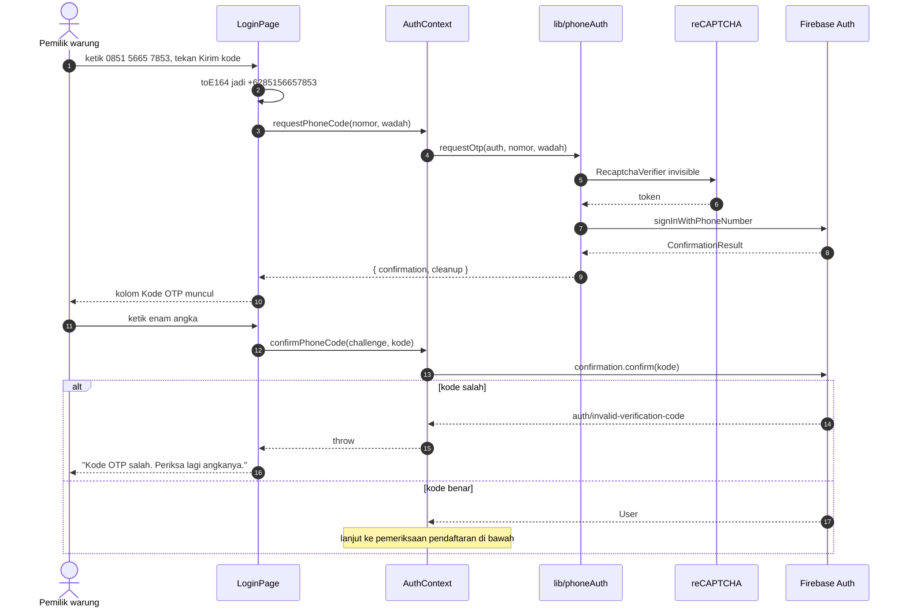
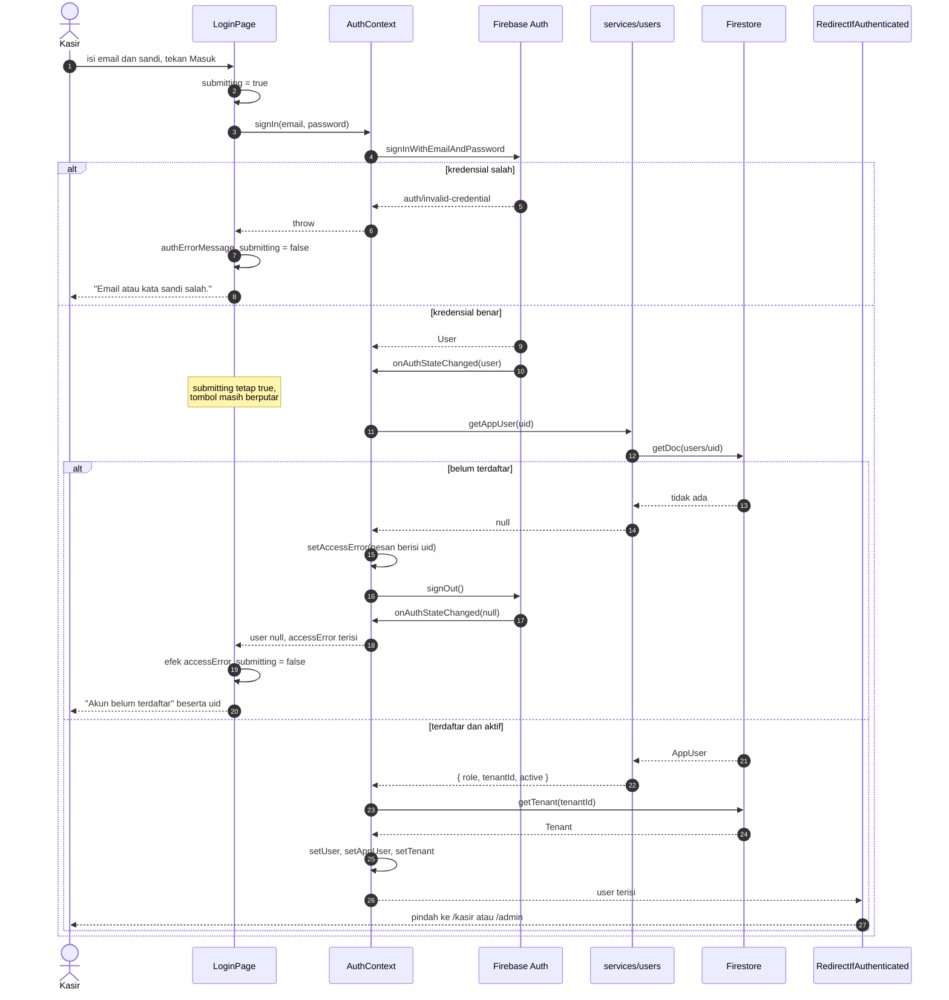
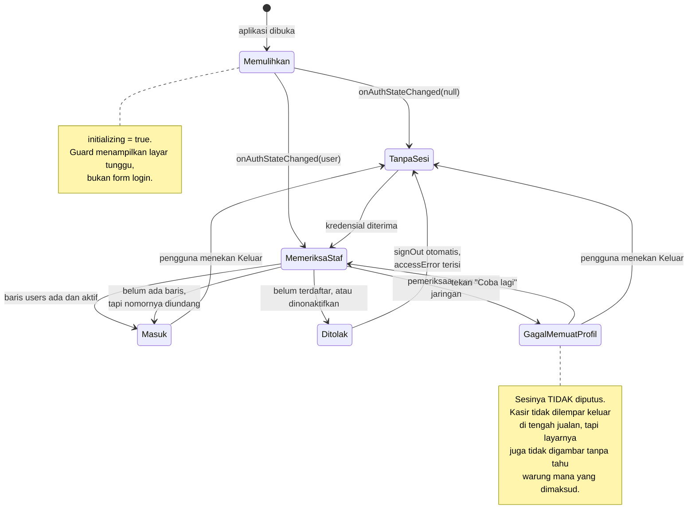
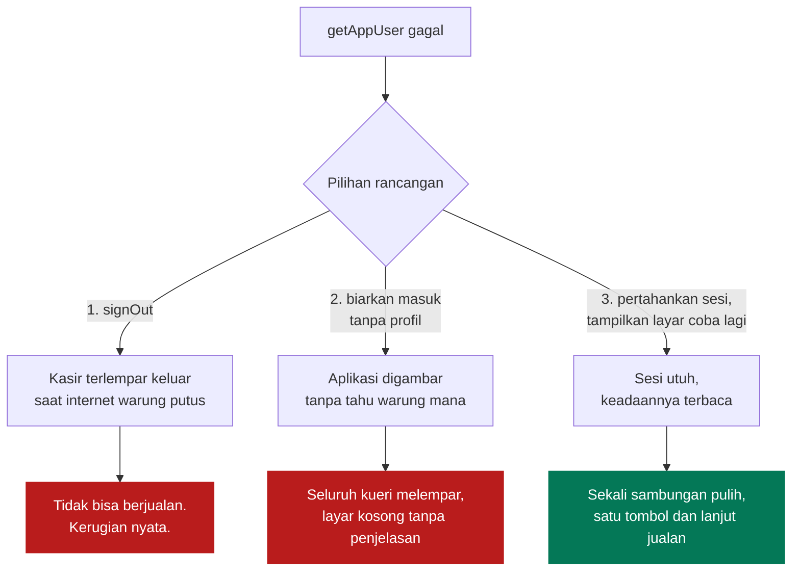
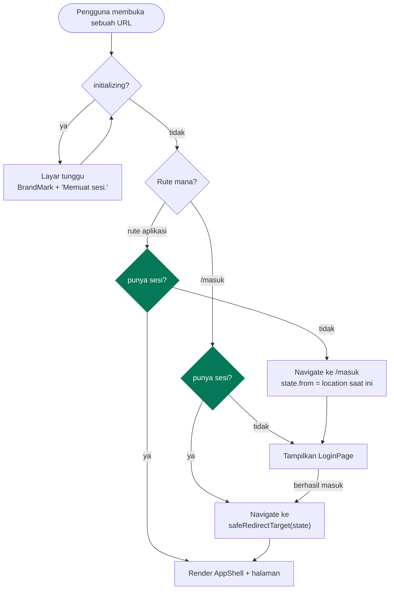
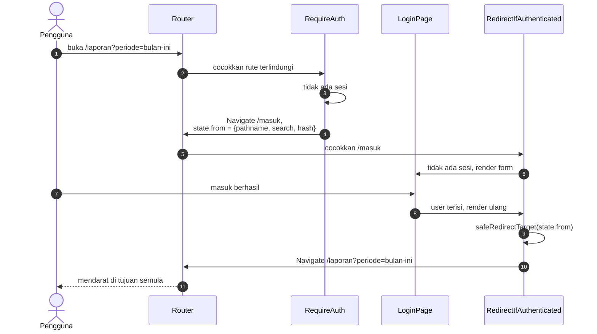
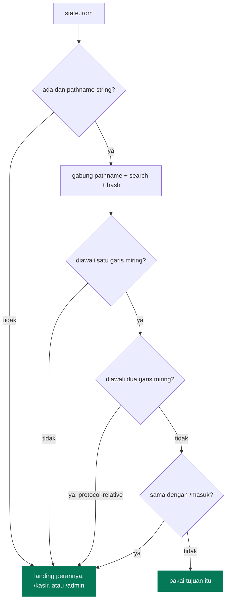

# Autentikasi dan Otorisasi

[← Kembali ke indeks](./README.md)

Dua hal yang sering dianggap satu, padahal berbeda dan ditangani terpisah:

| Lapisan | Menjawab | Ditangani oleh |
| --- | --- | --- |
| Autentikasi | Siapa orang ini | Firebase Authentication |
| Otorisasi | Boleh apa orang ini, di warung mana | Dokumen `users/{uid}` + Security Rules |

**Lolos autentikasi tidak berarti lolos otorisasi.** Pemilik akun Google mana pun
bisa membuktikan identitasnya, begitu juga pemilik nomor HP mana pun. Yang
menentukan boleh tidaknya menyentuh data, dan data warung yang mana, adalah
dokumen `users/{uid}` beserta `tenantId` di dalamnya.

Ada tiga metode masuk. Nomor HP didahulukan di layar dan dua sisanya
disembunyikan di balik satu tautan, karena pemilik warung menghafal nomornya
sendiri, tidak selalu punya email, dan tidak perlu memilih apa apa.

| Metode | Untuk siapa | Catatan |
| --- | --- | --- |
| Nomor HP (OTP) | Orang unit usaha | Butuh reCAPTCHA, kode enam angka lewat SMS. Boleh diketik `0851…` maupun `+62851…` |
| Email dan kata sandi | Admin platform, dan orang warung yang dibuatkan admin | Tidak butuh reCAPTCHA |
| Google | Akun yang sudah ada | Tidak bisa dibuatkan admin, harus sign-in sendiri dulu |

## Alur masuk dengan nomor HP

**Nomor selalu disimpan dalam E.164** (`+6285…`) dan hanya ditampilkan sebagai
`0851…`. Konversinya cuma ada di [`src/lib/phone.ts`](../src/lib/phone.ts),
supaya tidak ada layar yang menebak sendiri lalu mengirim nomor yang salah.

**Masuk pertama kali bisa sekaligus jadi pendaftaran.** Kalau nomor itu punya
undangan, barisnya di `users` dibuat tepat setelah OTP-nya berhasil, dan orangnya
langsung mendarat di unit usahanya tanpa pernah melihat penolakan. Alurnya di
[Multi Warung](./multi-warung.md#undangan-nomor-hp).

**reCAPTCHA memakai kotak centang, bukan mode tak terlihat.** Mode tak terlihat
lebih rapi, tapi hanya selama ia mempercayai pengunjungnya. Kalau tidak, ia
menaikkan tantangan gambar, dan kalau tantangan itu tidak diselesaikan maka
`signInWithPhoneNumber` tidak pernah selesai: tanpa error, tanpa SMS, hanya
tombol yang berputar. Kegagalan yang tidak bisa dilihat maupun dilaporkan adalah
yang terburuk untuk layar masuk, jadi ditukar dengan satu ketukan yang terlihat.

**Ada batas waktu.** Permintaan yang tidak dijawab dalam tiga menit berhenti
dengan `auth/otp-timeout`, bukan menggantung selamanya.

**Pembersihan reCAPTCHA harus tahan dipanggil berkali kali.**
`RecaptchaVerifier.clear()` melempar `auth/internal-error` kalau verifiernya
sudah dibuang, dan dua pemanggil yang sama sama benar memang memanggilnya dua
kali: alur OTP membersihkan setelah kodenya dipakai, lalu React membersihkan
sekali lagi saat layarnya dilepas. Lemparan kedua itu terjadi di dalam cleanup
efek, jadi tidak ada yang menangkapnya dan seluruh aplikasi ikut kosong tepat
setelah kode yang benar dimasukkan.

## Alur masuk dengan email dan kata sandi

Perhatikan langkah setelah kredensial diterima: **`submitting` sengaja tidak
direset**. Pemeriksaan pendaftaran masih berjalan, dan kalau tombol berhenti
berputar di situ, kasir akan mengira klik pertamanya gagal lalu menekannya lagi.

Tujuan setelah masuk berbeda menurut perannya: orang warung mendarat di layar
kasir, admin platform di daftar warung. Kalau sebelumnya ada tautan dalam yang
dituju, tautan itulah yang dipulihkan.

## Alur masuk dengan Google

**Kenapa `prompt: select_account`.** Satu perangkat kasir dipakai bergantian.
Tanpa paksaan memilih akun, Google akan diam diam memakai sesi terakhir, dan
struk tercatat atas nama orang yang salah. Nama kasir ikut tersimpan permanen di
dokumen penjualan, jadi kesalahan ini tidak bisa diperbaiki belakangan.

## Mesin keadaan sesi

### Kalau profilnya gagal dibaca

`getAppUser` bisa melempar error, hampir selalu karena jaringan. Ada tiga pilihan
rancangan, dan yang dipakai adalah yang ketiga.

Pilihan kedua dulu masuk akal ketika koleksinya masih datar: sesi cukup untuk
membaca cache lokal. Sejak data pindah ke bawah warungnya masing masing, itu
tidak berlaku lagi, karena tanpa `tenantId` tidak ada jalur yang bisa dibaca.

Dalam praktiknya pilihan ketiga jarang terlihat: `getDoc` jatuh ke cache
persisten saat offline, jadi profil yang pernah dibaca tetap terbaca tanpa
jaringan.

Pemeriksaan di klien tetap hanya untuk pengalaman pengguna. Lapisan keamanan yang
sesungguhnya ada di `firestore.rules`, dan itu tidak bisa dilewati dari browser.

## Penjagaan rute

Dijaga di tingkat rute, bukan di dalam komponen halaman. Kodenya di
[`src/components/routing/AuthGuards.tsx`](../src/components/routing/AuthGuards.tsx).

| Gerbang | Menjaga | Memantulkan ke |
| --- | --- | --- |
| `RequireAuth` | seluruh aplikasi | `/masuk` |
| `RedirectIfAuthenticated` | `/masuk` | tujuan tersimpan, atau landing perannya |
| `RequireTenantUser` | halaman warung | `/admin` |
| `RequireAdmin` | halaman platform | `/kasir` |

Dua gerbang terakhir memisahkan admin platform dari orang warung. Pemisahannya
bukan sekadar menyembunyikan menu: `firestore.rules` menegakkan batas yang sama
di server, jadi admin yang memaksa membuka `/laporan` tetap tidak mendapat satu
angka pun. Lihat [Multi Warung](./multi-warung.md#dua-dunia).

**Kenapa di tingkat rute.** Kalau pemeriksaan ada di dalam halaman, halaman baru
bisa lupa menuliskannya dan langsung bocor. Dengan guard membungkus `<Outlet />`,
halaman baru terlindungi hanya dengan didaftarkan di tempat yang benar.

### Membawa tujuan awal

### `safeRedirectTarget`

State navigasi tidak bisa diisi lewat URL, tapi tetap divalidasi:

Penolakan `//` mencegah pola `//situs-lain.com` yang oleh browser dibaca sebagai
alamat absolut. Penolakan `/masuk` mencegah pantulan tak berujung.

## Hasil pengujian

Alur ini sudah diuji di Chromium headless. Semua kasus lulus:

| Keadaan sesi | URL dibuka | Hasil |
| --- | --- | --- |
| belum masuk | `/`, `/kasir`, `/produk`, `/transaksi`, `/beban`, `/laporan`, path ngawur | semua dipantulkan ke `/masuk` |
| belum masuk | `/masuk` | form login tampil |
| belum masuk | deep link | tujuan tersimpan di history state |
| sudah masuk | `/masuk` | dipantulkan ke `/kasir` |
| sudah masuk | `/kasir`, `/laporan` | halaman tampil langsung |
| sesi masih dimuat | `/kasir`, `/masuk` | layar tunggu, bukan form maupun isi aplikasi |

## Pesan error

Kode Firebase diterjemahkan di `authErrorMessage`
([`src/contexts/AuthContext.tsx`](../src/contexts/AuthContext.tsx)).

| Kode | Ditampilkan sebagai |
| --- | --- |
| `auth/invalid-credential`, `auth/wrong-password`, `auth/user-not-found` | Email atau kata sandi salah. |
| `auth/too-many-requests` | Terlalu banyak percobaan gagal. Coba lagi beberapa menit lagi. |
| `auth/network-request-failed` | Tidak ada koneksi internet. |
| `auth/popup-closed-by-user`, `auth/cancelled-popup-request` | *(string kosong, tidak ditampilkan)* |
| `auth/popup-blocked` | Jendela Google diblokir browser. |
| `auth/unauthorized-domain` | Domain belum diizinkan, beserta letak pengaturannya. |
| `auth/operation-not-allowed` | Metode masuk belum diaktifkan di Console. |
| `auth/account-exists-with-different-credential` | Email sudah dipakai metode lain. |

Tiga kode terakhir menunjuk langsung ke menu Firebase Console yang harus dibuka,
karena ketiganya adalah salah konfigurasi, bukan salah pengguna.
