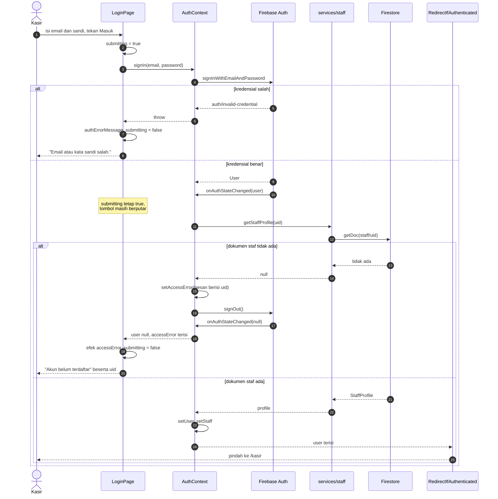
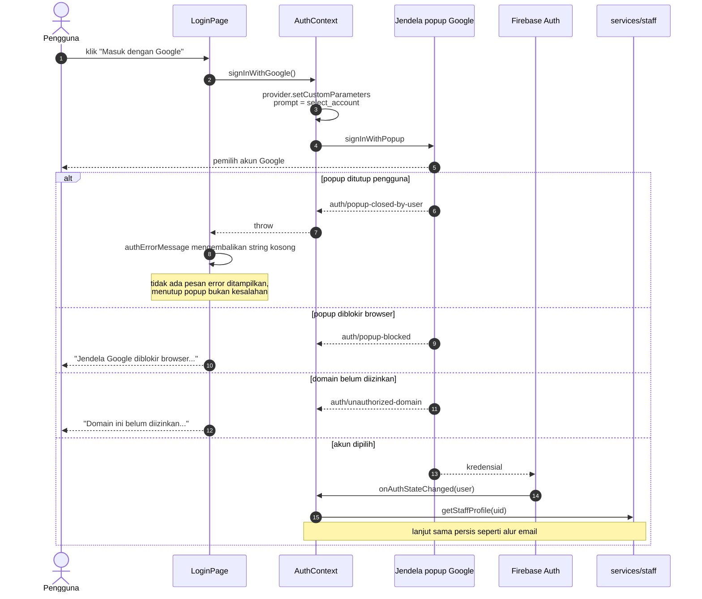
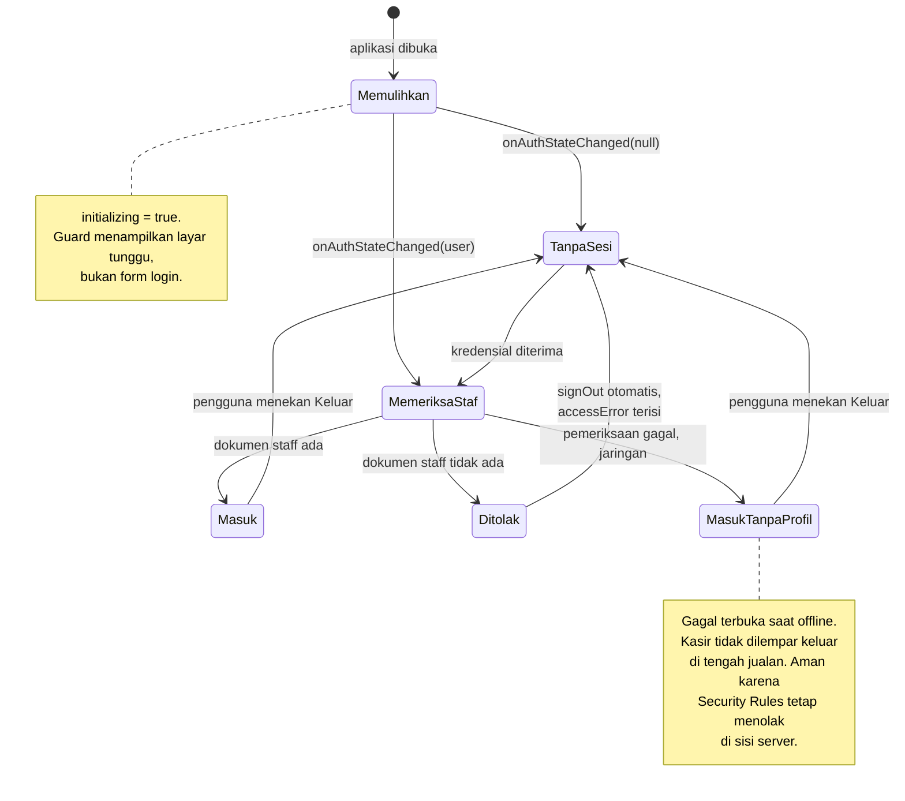
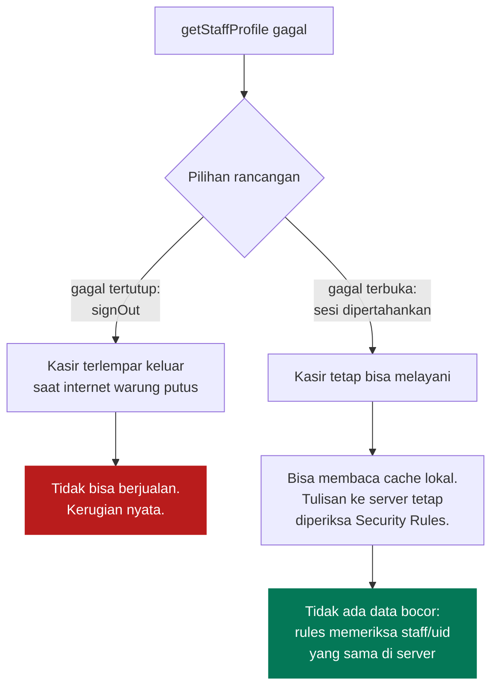
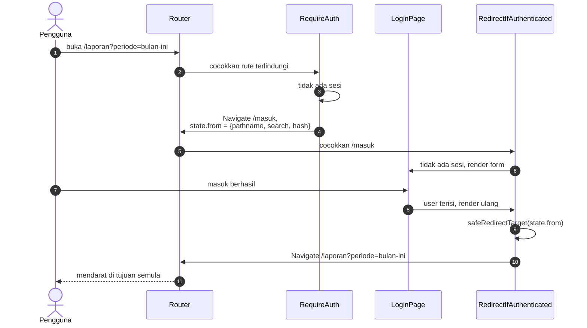
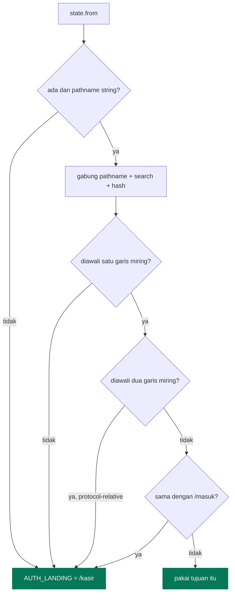

# Autentikasi dan Otorisasi

[← Kembali ke indeks](./README.md)

Dua hal yang sering dianggap satu, padahal berbeda dan ditangani terpisah:

| Lapisan | Menjawab | Ditangani oleh |
| --- | --- | --- |
| Autentikasi | Siapa orang ini | Firebase Authentication |
| Otorisasi | Boleh apa orang ini | Dokumen `staff/{uid}` + Security Rules |

**Lolos autentikasi tidak berarti lolos otorisasi.** Sejak Google Sign-In aktif,
pemilik akun Google mana pun bisa membuktikan identitasnya. Yang menentukan boleh
tidaknya menyentuh data toko adalah keberadaan dokumen `staff/{uid}`.

## Alur masuk dengan email dan kata sandi

Perhatikan langkah setelah kredensial diterima: **`submitting` sengaja tidak
direset**. Pemeriksaan staf masih berjalan, dan kalau tombol berhenti berputar di
situ, kasir akan mengira klik pertamanya gagal lalu menekannya lagi.

## Alur masuk dengan Google

**Kenapa `prompt: select_account`.** Satu perangkat kasir dipakai bergantian.
Tanpa paksaan memilih akun, Google akan diam diam memakai sesi terakhir, dan
struk tercatat atas nama orang yang salah. Nama kasir ikut tersimpan permanen di
dokumen penjualan, jadi kesalahan ini tidak bisa diperbaiki belakangan.

## Mesin keadaan sesi

### Kenapa gagal terbuka, bukan gagal tertutup

Kalau `getStaffProfile` melempar error karena jaringan mati, kode **tetap
mempertahankan sesi**.

Pemeriksaan staf di klien hanya untuk pengalaman pengguna. Lapisan keamanan yang
sesungguhnya ada di `firestore.rules`, dan itu tidak bisa dilewati dari browser.

## Penjagaan rute

Dijaga di tingkat rute, bukan di dalam komponen halaman. Kodenya di
[`src/components/routing/AuthGuards.tsx`](../src/components/routing/AuthGuards.tsx).

**Kenapa di tingkat rute.** Kalau pemeriksaan ada di dalam halaman, halaman baru
bisa lupa menuliskannya dan langsung bocor. Dengan guard membungkus `<Outlet />`,
halaman baru terlindungi hanya dengan didaftarkan di tempat yang benar.

### Membawa tujuan awal

### `safeRedirectTarget`

State navigasi tidak bisa diisi lewat URL, tapi tetap divalidasi:

Penolakan `//` mencegah pola `//situs-lain.com` yang oleh browser dibaca sebagai
alamat absolut. Penolakan `/masuk` mencegah pantulan tak berujung.

## Hasil pengujian

Alur ini sudah diuji di Chromium headless. Semua kasus lulus:

| Keadaan sesi | URL dibuka | Hasil |
| --- | --- | --- |
| belum masuk | `/`, `/kasir`, `/produk`, `/transaksi`, `/beban`, `/laporan`, path ngawur | semua dipantulkan ke `/masuk` |
| belum masuk | `/masuk` | form login tampil |
| belum masuk | deep link | tujuan tersimpan di history state |
| sudah masuk | `/masuk` | dipantulkan ke `/kasir` |
| sudah masuk | `/kasir`, `/laporan` | halaman tampil langsung |
| sesi masih dimuat | `/kasir`, `/masuk` | layar tunggu, bukan form maupun isi aplikasi |

## Pesan error

Kode Firebase diterjemahkan di `authErrorMessage`
([`src/contexts/AuthContext.tsx`](../src/contexts/AuthContext.tsx)).

| Kode | Ditampilkan sebagai |
| --- | --- |
| `auth/invalid-credential`, `auth/wrong-password`, `auth/user-not-found` | Email atau kata sandi salah. |
| `auth/too-many-requests` | Terlalu banyak percobaan gagal. Coba lagi beberapa menit lagi. |
| `auth/network-request-failed` | Tidak ada koneksi internet. |
| `auth/popup-closed-by-user`, `auth/cancelled-popup-request` | *(string kosong, tidak ditampilkan)* |
| `auth/popup-blocked` | Jendela Google diblokir browser. |
| `auth/unauthorized-domain` | Domain belum diizinkan, beserta letak pengaturannya. |
| `auth/operation-not-allowed` | Metode masuk belum diaktifkan di Console. |
| `auth/account-exists-with-different-credential` | Email sudah dipakai metode lain. |

Tiga kode terakhir menunjuk langsung ke menu Firebase Console yang harus dibuka,
karena ketiganya adalah salah konfigurasi, bukan salah pengguna.
