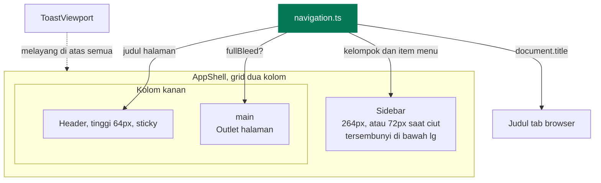
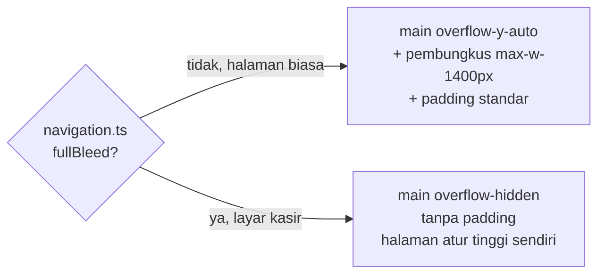
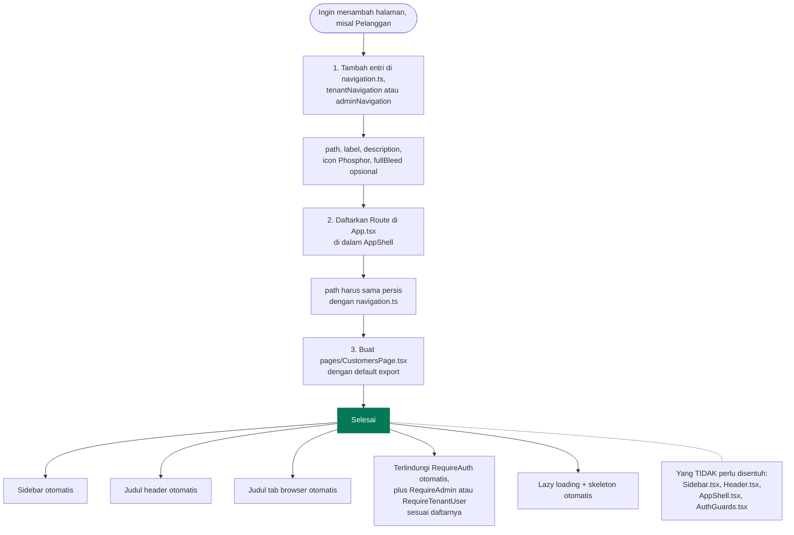
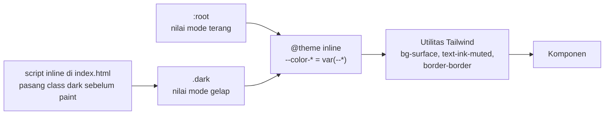
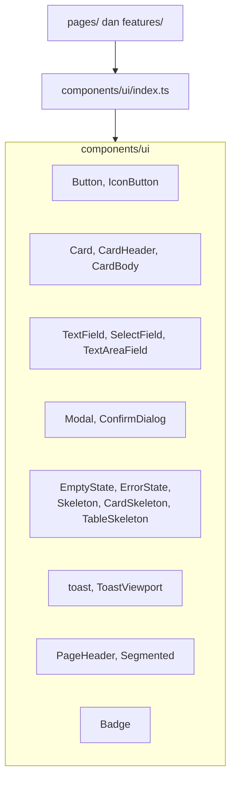
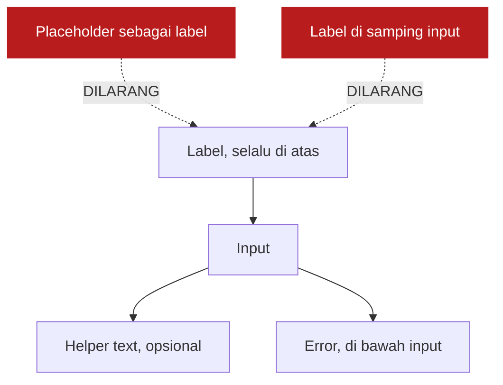
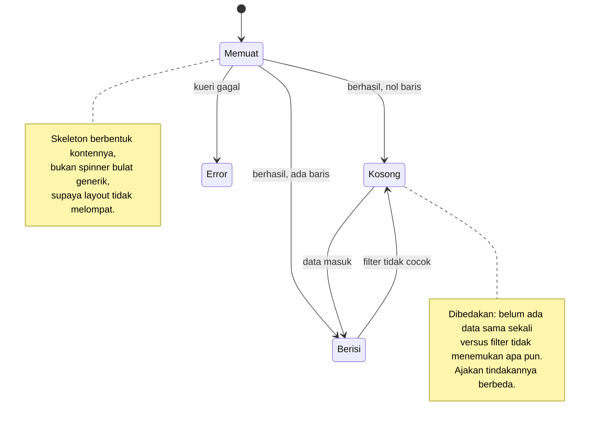
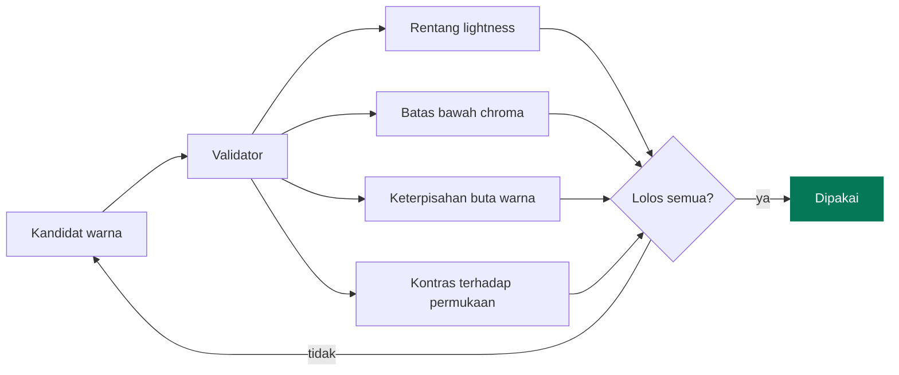

# Frontend

[← Kembali ke indeks](./README.md)

## Struktur folder

```
src/
  App.tsx                 peta rute
  main.tsx                titik masuk
  index.css               token desain, base layer, CSS cetak

  components/
    layout/               kerangka aplikasi
      AppShell.tsx        grid sidebar + header + konten
      Sidebar.tsx         navigasi, rail ciut, drawer ponsel
      Header.tsx          judul halaman, tema, menu pengguna
      BrandMark.tsx       monogram nama toko
      navigation.ts       SATU SUMBER KEBENARAN daftar menu,
                          tenantNavigation dan adminNavigation
    routing/
      AuthGuards.tsx      RequireAuth, RedirectIfAuthenticated,
                          RequireAdmin, RequireTenantUser
    ui/                   kit komponen bebas domain

  features/               komponen yang tahu domain
    cashier/  products/  expenses/  sales/  dashboard/

  hooks/                  useProducts, usePeriod, useTheme
  lib/                    firebase, format, profit, errors, cn
  pages/                  satu berkas per rute, default export
  services/               satu satunya pintu ke Firestore
  types/                  model data
```

## Kerangka aplikasi



`AppShell` juga membungkus `<Outlet />` dengan `Suspense`, sehingga halaman yang
sedang diunduh menampilkan rangka berbentuk kontennya, bukan layar kosong.

### Dua mode area konten



Panel keranjang di layar kasir harus menempel ke tepi layar dan punya area scroll
sendiri, sehingga ia tidak bisa memakai pembungkus standar.

## Menambah halaman baru



Kalau menambah halaman terasa perlu mengubah berkas layout, kemungkinan besar
ada yang salah di rancangannya.

## Token desain

Semua warna didefinisikan sebagai variabel CSS di `index.css`, lalu dipetakan ke
utilitas Tailwind lewat `@theme inline`.



**Aturan mutlak: pakai token, jangan warna Tailwind mentah.** Tulis `bg-surface`,
bukan `bg-white`. Tulis `text-ink-muted`, bukan `text-zinc-500`. Ini yang membuat
mode gelap ikut benar tanpa menulis varian `dark:` di mana mana.

### Daftar token

| Kelompok | Token | Dipakai untuk |
| --- | --- | --- |
| Permukaan | `bg`, `surface`, `surface-2`, `surface-hover` | Latar halaman, kartu, baris, hover |
| Garis | `border`, `border-strong` | Pembatas halus, tepi kontrol |
| Teks | `ink`, `ink-muted`, `ink-subtle`, `ink-inverse` | Hierarki tulisan |
| Aksen | `accent`, `accent-hover`, `accent-fg`, `accent-soft`, `accent-soft-fg` | Tombol utama, badge, sorotan |
| Status | `danger*`, `warning*` | Error, peringatan stok |
| Sidebar | `sidebar`, `sidebar-border`, `sidebar-ink`, `sidebar-ink-active`, `sidebar-active`, `sidebar-bar` | Navigasi, selalu gelap di kedua mode |
| Grafik | `--chart-1`, `--chart-2`, `--chart-grid`, `--chart-axis` | Deret data |

### Aksen bergeser antar mode

| Mode | Nilai aksen | Alasan |
| --- | --- | --- |
| Terang | emerald-700 `#047857` | Teks putih di atasnya lolos WCAG AA |
| Gelap | emerald-500 `#10b981` | Hierarki yang menonjol di terang harus tetap menonjol di gelap |

Bukan sekadar dibalik. Setiap langkah dipilih ulang untuk permukaannya sendiri.

### Skala radius dikunci

| Kelas | Nilai | Untuk |
| --- | --- | --- |
| `rounded-control` | 10px | Tombol, input, select |
| `rounded-panel` | 14px | Kartu, modal, panel |
| `rounded-full` | penuh | Badge, chip kategori |

Mencampur di luar aturan ini membuat tampilan terasa berantakan meski setiap
komponennya rapi sendiri sendiri.

## Kit komponen



### Aturan form



`aria-invalid` dan `aria-describedby` dipasang otomatis oleh `FieldShell`, jadi
tidak perlu diurus tiap pemakaian.

### Empat keadaan wajib

Setiap layar yang mengambil data harus menangani keempatnya.



Perhatikan pemisahan pada keadaan kosong. "Belum ada produk" mengajak menambah
produk. "Tidak ada produk yang cocok" mengajak mengatur ulang filter. Menyamakan
keduanya membuat pengguna bingung.

## Grafik

Mengikuti aturan visualisasi data yang ketat. Kodenya di
[`SalesTrendChart.tsx`](../src/features/dashboard/SalesTrendChart.tsx).

| Aturan | Penerapan di sini |
| --- | --- |
| Satu sumbu saja | Omzet dan laba bersih sama sama rupiah, jadi satu sumbu. Dua ukuran berskala beda wajib dipisah jadi dua grafik |
| Warna mengikuti entitas | Slot 1 selalu omzet, slot 2 selalu laba, tidak pernah bertukar |
| Legenda untuk dua deret atau lebih | Selalu ada |
| Identitas bukan hanya warna | Laba bersih memakai garis putus putus, ditambah tampilan tabel |
| Marka tipis, grid mundur | Garis 2px, grid putus putus tipis |
| Bentuk yang benar | Laporan laba rugi tetap tabel, bukan grafik |

### Palet grafik sudah divalidasi



Emerald-500 sempat gagal rentang lightness pada permukaan gelap dan diganti
`#0da271`. **Jangan mengganti nilai `--chart-*` tanpa menjalankan validator
lagi.**

## Responsif

Titik henti standar Tailwind. Aturan yang dipegang:

| Aturan | Alasan |
| --- | --- |
| `min-h-[100dvh]`, bukan `h-screen` | Bilah alamat Safari iOS membuat `100vh` meleset |
| CSS Grid, bukan matematika flex | Tidak ada `w-[calc(33%-1rem)]` |
| Tabel lebar dibungkus `overflow-x-auto` | Halaman tidak pernah menggeser mendatar |
| Runtuh mobile dinyatakan eksplisit | Setiap tata letak multi kolom menyebut perilakunya di bawah `md` |

| Layar | Sidebar | Keranjang kasir |
| --- | --- | --- |
| `>= lg` (1024px) | Kolom tetap, bisa diciutkan | Panel menempel 24rem |
| `< lg` | Drawer di atas konten | Bilah total + lembar modal |

## Ikon dan tipografi

- **Ikon hanya dari `@phosphor-icons/react`.** Satu keluarga untuk seluruh
  proyek. Tidak ada path SVG buatan tangan.
- **Font Geist dan Geist Mono** di-bundle lewat Fontsource. Tidak memanggil
  Google Fonts, jadi tidak ada permintaan lintas domain dan tidak ada pergeseran
  tata letak saat font tiba.
- **Angka uang memakai class `tabular`** agar kolomnya rata. Tanpa itu, angka di
  tabel bergeser goyang saat nilainya berubah.

## Aksesibilitas

| Hal | Penerapan |
| --- | --- |
| Kontras | Seluruh pasangan teks dan latar diperiksa terhadap WCAG AA |
| Fokus | Cincin fokus terlihat lewat `:focus-visible`, warna aksen |
| Tombol ikon | `IconButton` mewajibkan prop `label`, dipasang ke `aria-label` dan `title` |
| Modal | `role="dialog"`, `aria-modal`, tutup dengan Escape, fokus dipindah ke dalam, scroll latar dikunci |
| Gerak | `prefers-reduced-motion` mematikan animasi dan transisi |
| Grafik | Identitas deret tidak pernah hanya warna, dan ada tampilan tabel |
