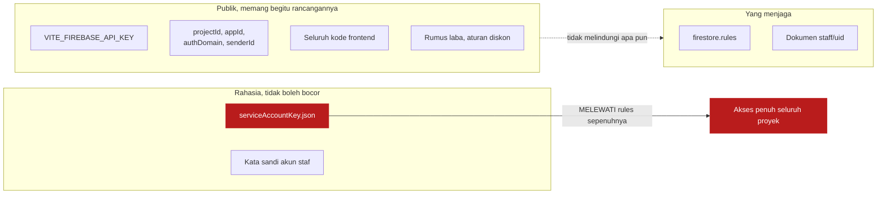
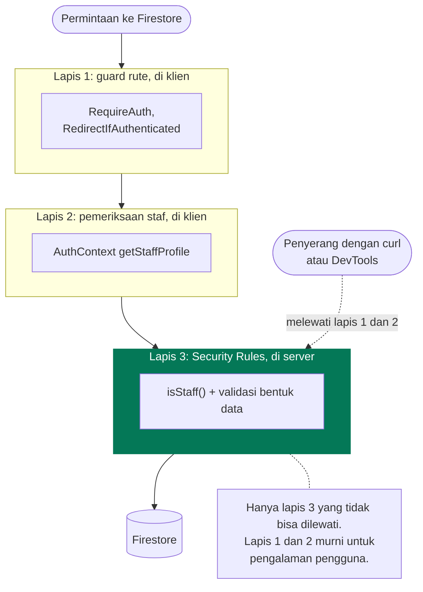
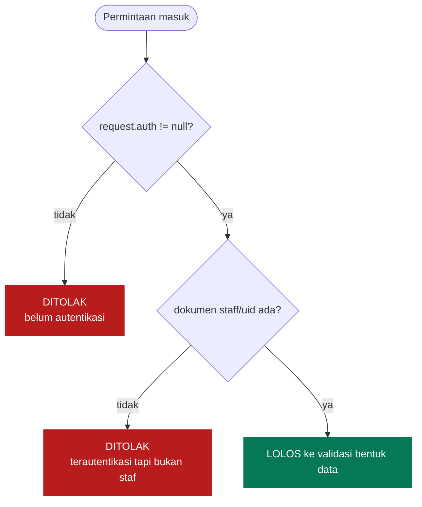
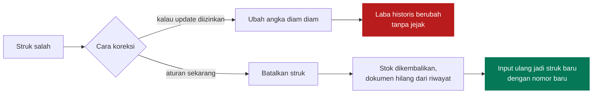
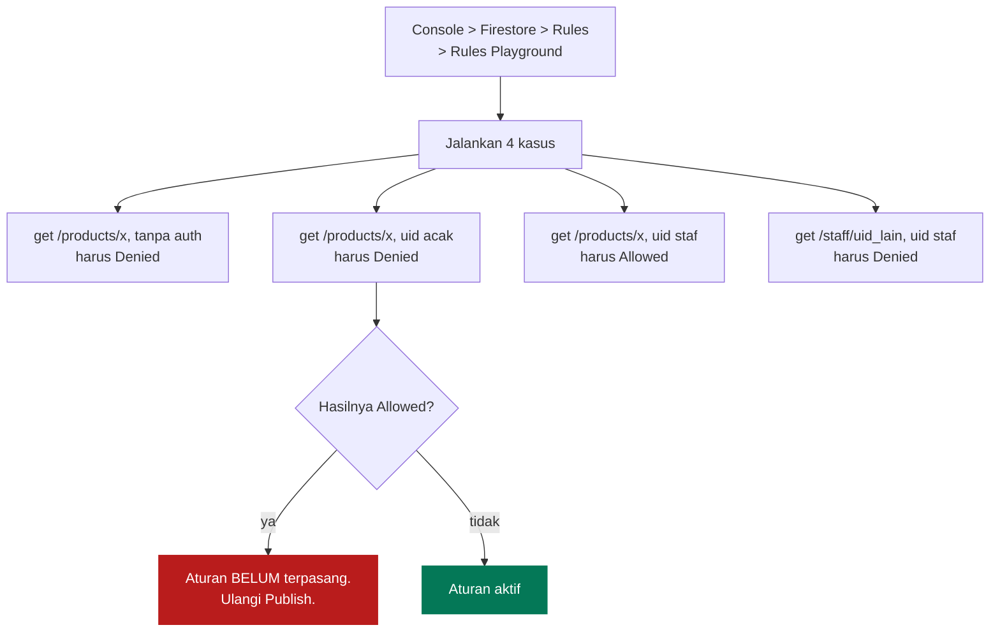

# Keamanan

[← Kembali ke indeks](./README.md)

Tanpa backend, [`firestore.rules`](../firestore.rules) adalah satu satunya hal
yang benar benar menjaga data. Semua yang ada di kode frontend bisa dibaca dan
dimodifikasi siapa saja lewat DevTools.

## Apa yang publik dan apa yang rahasia



`VITE_FIREBASE_API_KEY` **bukan kata sandi**. Ia pengenal proyek yang memang ikut
ter-bundle ke browser pada setiap aplikasi Firebase. Menyembunyikannya tidak
menambah keamanan sedikit pun.

`serviceAccountKey.json` sebaliknya adalah kunci sesungguhnya. Ia melewati
Security Rules sepenuhnya. Berkas itu ada di `.gitignore` dengan tiga pola
(`serviceAccountKey.json`, `*serviceAccount*.json`, `*-firebase-adminsdk-*.json`)
dan hanya dipakai `scripts/seed.mjs` yang dijalankan manual.

## Model ancaman

| Ancaman | Kemungkinan | Yang menahan | Sisa risiko |
| --- | --- | --- | --- |
| Orang asing menebak URL aplikasi | Tinggi | Guard rute lalu Security Rules | Tidak ada, data tidak terbaca |
| Pemilik akun Google acak menekan "Masuk dengan Google" | **Tinggi** | Dokumen `staff/{uid}` wajib ada | Tidak ada, semua koleksi menolak |
| Penyerang memanggil Firestore REST langsung, melewati aplikasi | Sedang | Security Rules, tidak bergantung pada klien | Tidak ada |
| Kasir mengubah laba transaksi lama | Sedang | `allow update: if false` pada `sales` | Bisa menghapus lalu input ulang, dan itu tercatat sebagai hilangnya struk |
| Kasir mendaftarkan dirinya jadi pemilik | Rendah | `staff` `allow write: if false` | Tidak ada dari aplikasi |
| Oversell stok dari dua perangkat | Rendah | Rules menolak stok negatif | Batch ditolak, transaksi gagal dan harus diulang |
| `serviceAccountKey.json` ter-commit | Rendah | Tiga pola `.gitignore` | Total kalau sampai lolos, harus dicabut di Console |
| Penulisan offline oleh akun yang aksesnya dicabut | Rendah | Rules memeriksa saat sinkron | Data di-rollback diam diam, kasir tidak diberi tahu |

Baris terakhir adalah kelemahan yang diketahui dan diterima. Lihat
[Alur Kasir](./alur-kasir.md#batasannya-jujur).

## Lapisan pertahanan



Jangan pernah memindahkan aturan yang penting dari lapis 3 ke lapis 1 atau 2
dengan alasan "supaya lebih cepat". Keduanya bukan keamanan.

## Pembedahan Security Rules

### Gerbang `isStaff()`

```javascript
function isStaff() {
  return request.auth != null
    && exists(/databases/$(database)/documents/staff/$(request.auth.uid));
}
```



Cabang `D2` adalah alasan seluruh mekanisme ini ada. Sebelum Google Sign-In,
pemilik toko sendiri yang membuat setiap akun sehingga "sudah login" berarti
"orang toko". Setelah Google aktif, asumsi itu runtuh.

> `exists()` menambah satu operasi baca per evaluasi aturan. Untuk warung satu
> gerai jumlahnya tidak berarti, tapi perlu diingat kalau kelak ada kueri yang
> membaca ribuan dokumen sekaligus.

### Matriks izin

| Koleksi | read | create | update | delete |
| --- | --- | --- | --- | --- |
| `staff` | pemilik uid itu sendiri | tidak pernah | tidak pernah | tidak pernah |
| `products` | staf | staf + validasi | staf + validasi | staf |
| `sales` | staf | staf + validasi + `cashierId == uid` | **tidak pernah** | staf |
| `expenses` | staf | staf + validasi | staf + validasi | staf |

### Kenapa `sales` tidak bisa diedit



Pembatalan tetap menghapus jejak, jadi ini bukan audit trail sungguhan. Tapi ia
mencegah skenario yang lebih berbahaya: mengubah satu angka pada struk lama tanpa
ada yang menyadarinya.

### Validasi bentuk data

Rules tidak hanya memeriksa siapa, tapi juga apa yang ditulis.

| Koleksi | Yang diperiksa |
| --- | --- |
| `products` | `name` string tidak kosong; `costPrice`, `sellPrice`, `stock` angka >= 0 |
| `sales` | `cashierId` sama dengan uid pemanggil; `items` list tidak kosong; `total`, `totalCost` angka >= 0 |
| `expenses` | `description` string; `amount` angka >= 0 |

Pemeriksaan `stock >= 0` pada `products` berfungsi ganda sebagai **pencegah
oversell di sisi server**. `request.resource.data` berisi dokumen setelah
transform `increment` diterapkan, sehingga penjualan yang membuat stok jadi
negatif ditolak seluruh batch-nya.

Efek sampingnya perlu diketahui: transaksi itu **gagal total**, bukan tersimpan
sebagian. Kodenya ditangkap `saleErrorMessage` dan diterjemahkan jadi
"Kemungkinan stok salah satu barang sudah habis terjual dari perangkat lain."
daripada "permission denied" yang tidak berarti apa apa bagi kasir.

## Memverifikasi aturan sudah terpasang

Emulator Firestore butuh Java. Kalau tidak tersedia, pakai **Rules Playground**
di Firebase Console yang tidak butuh perkakas lokal sama sekali.



Kasus kedua yang paling penting. Ia membuktikan sekadar punya akun Google tidak
cukup untuk membaca data toko.

## Kesalahan yang sering terjadi

| Gejala | Penyebab | Perbaikan |
| --- | --- | --- |
| Semua kueri kena `permission-denied` walau sudah masuk | Dokumen `staff/{uid}` belum dibuat, atau id dokumennya id otomatis, bukan uid | Buat ulang dengan id dokumen = uid Auth |
| Aturan sudah diubah di repo tapi Firestore masih menolak | Rules tidak ikut ter-deploy lewat Vercel | `firebase deploy --only firestore:rules` |
| Login Google gagal di produksi tapi berhasil di localhost | Domain Vercel belum terdaftar | Console > Authentication > Settings > Authorized domains |
| Aplikasi bisa dibuka siapa saja | Firestore masih memakai aturan mode uji bawaan | Terapkan `firestore.rules` |

## Kalau kunci service account bocor

1. Firebase Console > Project settings > Service accounts, **hapus kunci itu**.
2. Buat kunci baru untuk pemakaian yang sah.
3. Periksa Firestore untuk dokumen yang tidak dikenal, terutama koleksi `staff`.
4. Kalau kuncinya pernah ter-commit, menghapusnya dari commit terbaru tidak cukup
   karena ia masih ada di history. Kunci harus dicabut di Console.

Kunci di repositori ini sudah diperiksa: tidak pernah masuk history git.
