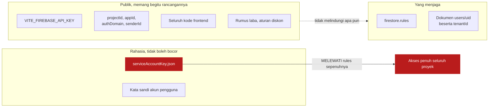
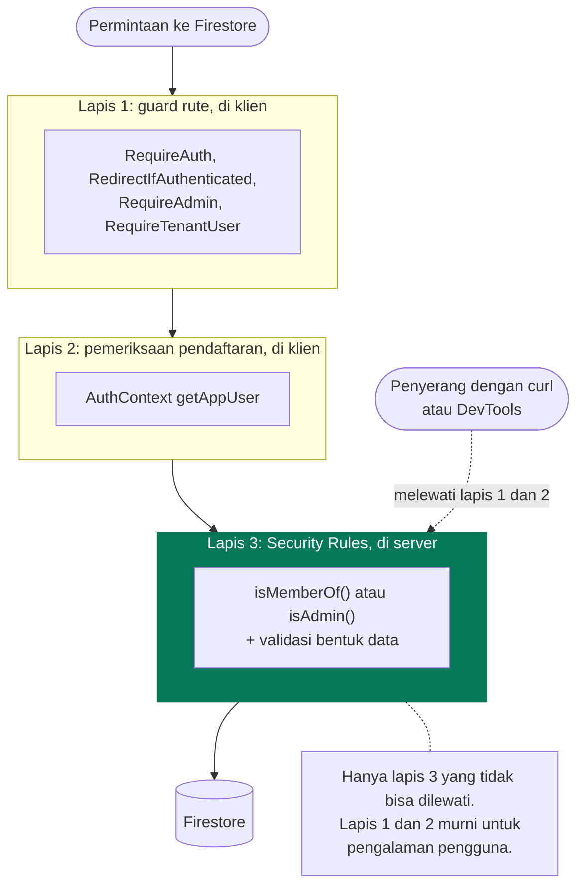
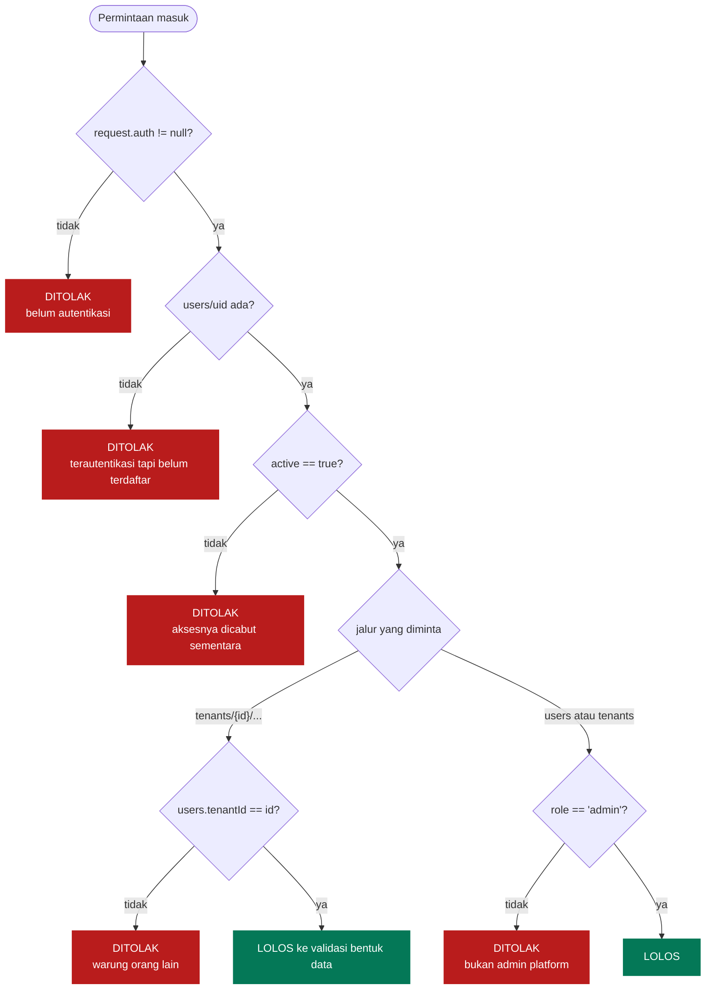
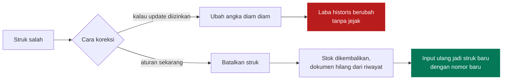
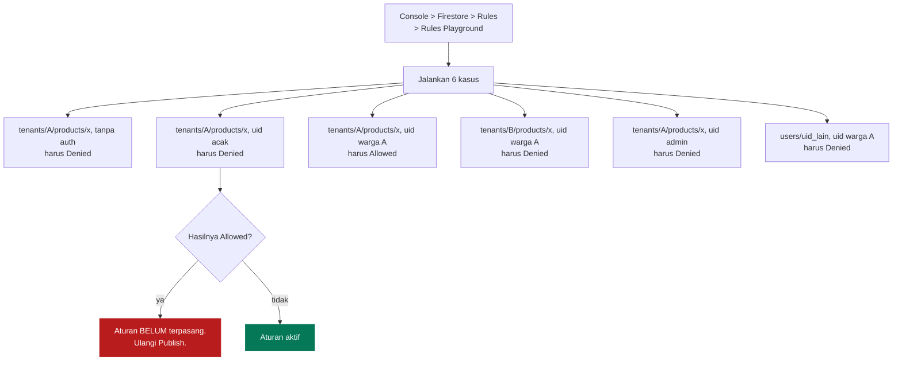

# Keamanan

[← Kembali ke indeks](./README.md)

Tanpa backend, [`firestore.rules`](../firestore.rules) adalah satu satunya hal
yang benar benar menjaga data. Semua yang ada di kode frontend bisa dibaca dan
dimodifikasi siapa saja lewat DevTools.

## Apa yang publik dan apa yang rahasia



`VITE_FIREBASE_API_KEY` **bukan kata sandi**. Ia pengenal proyek yang memang ikut
ter-bundle ke browser pada setiap aplikasi Firebase. Menyembunyikannya tidak
menambah keamanan sedikit pun.

`serviceAccountKey.json` sebaliknya adalah kunci sesungguhnya. Ia melewati
Security Rules sepenuhnya. Berkas itu ada di `.gitignore` dengan tiga pola
(`serviceAccountKey.json`, `*serviceAccount*.json`, `*-firebase-adminsdk-*.json`)
dan hanya dipakai `scripts/seed.mjs` yang dijalankan manual.

## Model ancaman

| Ancaman | Kemungkinan | Yang menahan | Sisa risiko |
| --- | --- | --- | --- |
| Orang asing menebak URL aplikasi | Tinggi | Guard rute lalu Security Rules | Tidak ada, data tidak terbaca |
| Pemilik akun Google atau nomor HP acak berhasil autentikasi | **Tinggi** | Dokumen `users/{uid}` wajib ada | Tidak ada, semua koleksi menolak |
| Orang warung membaca pembukuan warung tetangga | **Tinggi** | Tenant ada di jalur dokumen, `isMemberOf(tenantId)` | Tidak ada, jalur lain ditolak server |
| Akun admin platform bocor | Sedang | Admin tidak diberi akses ke subkoleksi tenant mana pun | Daftar warung dan pengguna terbuka, pembukuan tidak |
| Penyerang memanggil Firestore REST langsung, melewati aplikasi | Sedang | Security Rules, tidak bergantung pada klien | Tidak ada |
| Kasir mengubah laba transaksi lama | Sedang | `allow update: if false` pada `sales` | Bisa menghapus lalu input ulang, dan itu tercatat sebagai hilangnya struk |
| Orang warung mendaftarkan dirinya atau orang lain | Rendah | `users` hanya bisa ditulis `isAdmin()` | Tidak ada dari aplikasi |
| Siapa pun mengangkat dirinya jadi admin platform | Rendah | `isValidUser()` menolak peran `admin` | Tidak ada, admin hanya lahir dari skrip seed |
| Oversell stok dari dua perangkat | Rendah | Rules menolak stok negatif | Batch ditolak, transaksi gagal dan harus diulang |
| `serviceAccountKey.json` ter-commit | Rendah | Tiga pola `.gitignore` | Total kalau sampai lolos, harus dicabut di Console |
| Penulisan offline oleh akun yang aksesnya dicabut | Rendah | Rules memeriksa saat sinkron | Data di-rollback diam diam, kasir tidak diberi tahu |

Baris terakhir adalah kelemahan yang diketahui dan diterima. Lihat
[Alur Kasir](./alur-kasir.md#batasannya-jujur).

## Lapisan pertahanan



Jangan pernah memindahkan aturan yang penting dari lapis 3 ke lapis 1 atau 2
dengan alasan "supaya lebih cepat". Keduanya bukan keamanan.

## Pembedahan Security Rules

### Tiga gerbang

```javascript
function isActive() {
  return isRegistered() && me().active == true;
}

function isAdmin() {
  return isActive() && me().role == 'admin';
}

function isMemberOf(tenantId) {
  return isActive() && me().tenantId == tenantId;
}
```

`me()` adalah `get()` ke `users/{request.auth.uid}`, dibaca **di server**. Itu
sebabnya `tenantId` tidak bisa dipalsukan: browser tidak pernah menyebutkannya,
aturan yang mengambilnya sendiri.



Cabang `D2` adalah alasan seluruh mekanisme ini ada. Kalau setiap akun dibuat
pemilik toko sendiri, "sudah login" berarti "orang toko". Dengan Google dan nomor
HP terbuka untuk siapa saja, asumsi itu runtuh.

Cabang `D4` adalah sekat antar warung, dan ia bekerja karena tenant ada di jalur
dokumen. Lihat [Multi Warung](./multi-warung.md#tenant-sebagai-jalur-bukan-field).

> `exists()` dan `get()` menambah operasi baca per evaluasi aturan. Untuk warung
> satu gerai jumlahnya tidak berarti, tapi perlu diingat kalau kelak ada kueri
> yang membaca ribuan dokumen sekaligus.

### Matriks izin

Untuk ringkasnya, "warga" berarti `isMemberOf(tenantId)`, yaitu orang warung itu
sendiri, dan "admin" berarti `isAdmin()`.

| Jalur | read | create | update | delete |
| --- | --- | --- | --- | --- |
| `users/{uid}` | uid itu sendiri, atau admin | admin + validasi | admin + validasi | admin, kecuali barisnya sendiri |
| `tenants/{id}` | warga, atau admin | admin | admin | admin |
| `tenants/{id}/products` | warga | warga + validasi | warga + validasi | warga |
| `tenants/{id}/recipes` | warga | warga + validasi | warga + validasi | warga |
| `tenants/{id}/productions` | warga | warga + validasi + `operatorId == uid` | **tidak pernah** | warga |
| `tenants/{id}/sales` | warga | warga + validasi + `cashierId == uid` | **tidak pernah** | warga |
| `tenants/{id}/expenses` | warga | warga + validasi | warga + validasi | warga |

**Perhatikan bahwa `admin` tidak muncul sama sekali di lima baris terakhir.**
Ketiadaan itulah jaminannya: satu akun admin yang bocor tidak berarti seluruh
pembukuan semua warung ikut terbuka. Jangan menambahkannya tanpa alasan baru yang
kuat.

Dua pengecualian kecil punya alasannya masing masing. Admin tidak boleh menghapus
barisnya sendiri, karena platform bisa kehilangan admin terakhirnya dan tidak ada
cara memulihkannya dari dalam aplikasi. Dan membaca `users/{uid}` sendiri
sengaja terbuka bagi siapa pun yang sudah login, karena orang yang belum
terdaftar perlu mendapat jawaban "tidak ada" supaya bisa ditolak dengan pesan
yang benar; kalau permintaannya ditolak aturan, klien membacanya sebagai
gangguan jaringan.

### Kenapa `sales` tidak bisa diedit



Pembatalan tetap menghapus jejak, jadi ini bukan audit trail sungguhan. Tapi ia
mencegah skenario yang lebih berbahaya: mengubah satu angka pada struk lama tanpa
ada yang menyadarinya.

### Validasi bentuk data

Rules tidak hanya memeriksa siapa, tapi juga apa yang ditulis.

| Koleksi | Yang diperiksa |
| --- | --- |
| `products` | `name` string tidak kosong; `costPrice`, `sellPrice`, `stock` angka >= 0 |
| `sales` | `cashierId` sama dengan uid pemanggil; `items` list tidak kosong; `total`, `totalCost` angka >= 0 |
| `expenses` | `description` string; `amount` angka >= 0 |

Pemeriksaan `stock >= 0` pada `products` berfungsi ganda sebagai **pencegah
oversell di sisi server**. `request.resource.data` berisi dokumen setelah
transform `increment` diterapkan, sehingga penjualan yang membuat stok jadi
negatif ditolak seluruh batch-nya.

Efek sampingnya perlu diketahui: transaksi itu **gagal total**, bukan tersimpan
sebagian. Kodenya ditangkap `saleErrorMessage` dan diterjemahkan jadi
"Kemungkinan stok salah satu barang sudah habis terjual dari perangkat lain."
daripada "permission denied" yang tidak berarti apa apa bagi kasir.

## Memverifikasi aturan sudah terpasang

Emulator Firestore butuh Java. Kalau tidak tersedia, pakai **Rules Playground**
di Firebase Console yang tidak butuh perkakas lokal sama sekali.



Kasus kedua yang paling penting. Ia membuktikan sekadar punya akun Google tidak
cukup untuk membaca data toko.

## Kesalahan yang sering terjadi

| Gejala | Penyebab | Perbaikan |
| --- | --- | --- |
| Semua kueri kena `permission-denied` walau sudah masuk | Dokumen `users/{uid}` belum dibuat, id dokumennya id otomatis dan bukan uid, `active` bernilai false, atau `tenantId`-nya menunjuk warung yang sudah tidak ada | Periksa barisnya di halaman Pengguna |
| Aturan sudah diubah di repo tapi Firestore masih menolak | Rules tidak ikut ter-deploy lewat Vercel | `firebase deploy --only firestore:rules` |
| Login Google gagal di produksi tapi berhasil di localhost | Domain Vercel belum terdaftar | Console > Authentication > Settings > Authorized domains |
| Aplikasi bisa dibuka siapa saja | Firestore masih memakai aturan mode uji bawaan | Terapkan `firestore.rules` |

## Kalau kunci service account bocor

1. Firebase Console > Project settings > Service accounts, **hapus kunci itu**.
2. Buat kunci baru untuk pemakaian yang sah.
3. Periksa Firestore untuk dokumen yang tidak dikenal, terutama koleksi `users`:
   baris asing di sana berarti akses ke salah satu warung.
4. Kalau kuncinya pernah ter-commit, menghapusnya dari commit terbaru tidak cukup
   karena ia masih ada di history. Kunci harus dicabut di Console.

Kunci di repositori ini sudah diperiksa: tidak pernah masuk history git.
