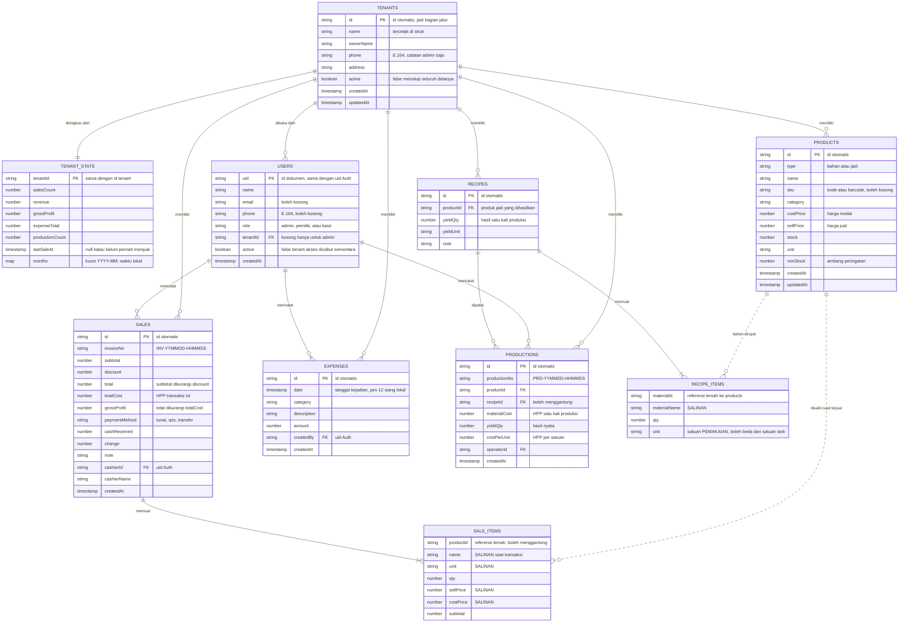
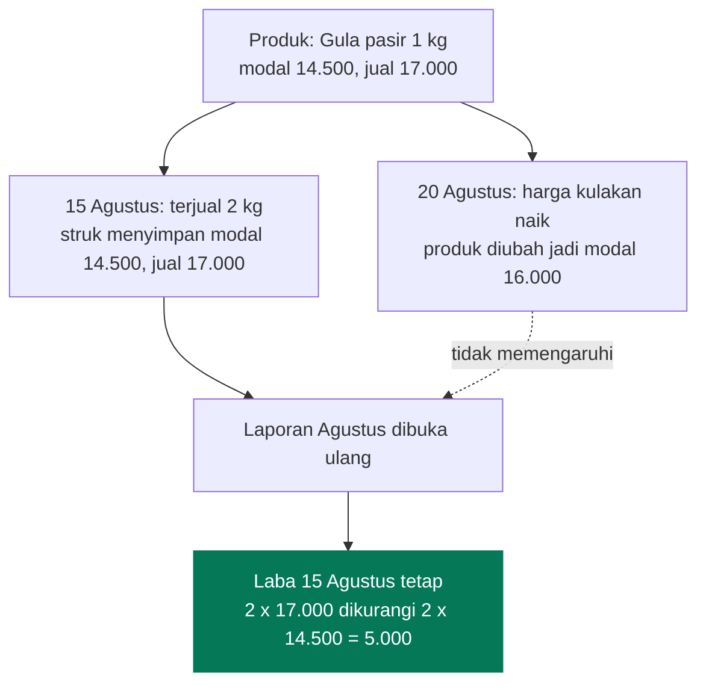
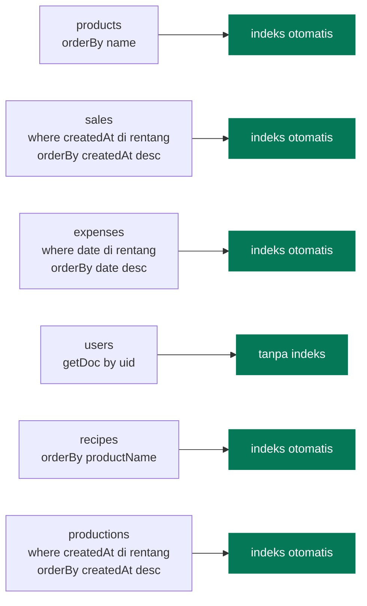

# Model Data

[← Kembali ke indeks](./README.md)

Dua koleksi di akar, dan lima subkoleksi di bawah tiap warung. Definisi tipenya
ada di [`src/types/index.ts`](../src/types/index.ts).

```
users/{uid}                          siapa boleh masuk, ke unit usaha mana
tenants/{tenantId}                   identitas unit usaha
tenantStats/{tenantId}               ringkasan angka, dibaca admin
tenants/{tenantId}/products/{id}
tenants/{tenantId}/recipes/{id}
tenants/{tenantId}/productions/{id}
tenants/{tenantId}/sales/{id}
tenants/{tenantId}/expenses/{id}
```

**Tenant adalah bagian dari jalur dokumen, bukan field di dalamnya**, dan itu
keputusan keamanan, bukan kerapian. Alasannya di
[Multi Warung](./multi-warung.md#tenant-sebagai-jalur-bukan-field). Jalurnya
dirakit di [`src/services/paths.ts`](../src/services/paths.ts).

Dua subkoleksi, `recipes` dan `productions`, dibahas terpisah di
[Produksi & HPP](./produksi.md) berikut alasan rancangannya.

## Diagram relasi



`SALE_ITEMS` bukan koleksi. Ia array di dalam dokumen `sales`. Digambar terpisah
supaya isinya terlihat.

## Denormalisasi yang disengaja

Setiap baris di `sales.items` menyimpan **salinan** `name`, `sellPrice`, dan
`costPrice` milik produk pada saat transaksi terjadi.



**Kenapa begitu.** Kalau laporan membaca harga dari dokumen produk, mengubah
harga hari ini akan menulis ulang laba bulan lalu. Bagi pemilik warung itu
terlihat seperti aplikasi mengarang angka, dan laporan jadi tidak bisa dipercaya.

Tiga akibat yang harus diterima:

1. **Produk boleh dihapus permanen.** Riwayat penjualan tidak ikut rusak karena
   ia tidak bergantung pada dokumen produk.
2. **`productId` adalah referensi lemah.** Ia boleh menunjuk dokumen yang sudah
   tidak ada. Kode yang memakainya wajib menangani kasus itu, misalnya
   `voidSale` yang melewati produk terhapus saat mengembalikan stok.
3. **Mengubah nama produk tidak mengubah struk lama.** Ini memang yang
   diinginkan.

## Contoh dokumen

### `users/{uid}`

```json
{
  "name": "Bu Sri",
  "email": "",
  "phone": "+6285156657853",
  "role": "pemilik",
  "tenantId": "mfKHMqMi7ltobe3hVXqj",
  "active": true,
  "createdAt": "2026-08-15T02:11:44.000Z"
}
```

Id dokumen wajib sama persis dengan `uid` dari Firebase Authentication, karena
Security Rules mencarinya lewat `request.auth.uid`. Id otomatis tidak akan
pernah cocok.

Salah satu dari `email` atau `phone` terisi, tergantung cara akunnya dibuat.
Untuk akun yang didaftarkan lewat UID, keduanya boleh kosong: keduanya cuma
untuk ditampilkan di daftar, bukan untuk mencocokkan apa pun.

`tenantId` kosong hanya untuk `role: "admin"`. Admin platform memang tidak punya
warung, dan tidak boleh punya.

### `tenants/{tenantId}/products/{id}`

```json
{
  "type": "jadi",
  "name": "Gula pasir 1 kg",
  "sku": "SB-001",
  "category": "Sembako",
  "costPrice": 14500,
  "sellPrice": 17000,
  "stock": 15,
  "unit": "kg",
  "minStock": 5,
  "createdAt": "2026-08-15T02:12:03.000Z",
  "updatedAt": "2026-08-15T09:40:18.000Z"
}
```

### `tenants/{tenantId}/sales/{id}`

```json
{
  "invoiceNo": "INV-260815-143052",
  "items": [
    {
      "productId": "8xKq2mNvR1pLc4TzWbHj",
      "name": "Gula pasir 1 kg",
      "unit": "kg",
      "qty": 2,
      "sellPrice": 17000,
      "costPrice": 14500,
      "subtotal": 34000
    },
    {
      "productId": "3aPd9sLkE7nMx2QrVyGt",
      "name": "Mie instan goreng",
      "unit": "pcs",
      "qty": 5,
      "sellPrice": 3500,
      "costPrice": 2800,
      "subtotal": 17500
    }
  ],
  "subtotal": 51500,
  "discount": 1500,
  "total": 50000,
  "totalCost": 43000,
  "grossProfit": 7000,
  "paymentMethod": "tunai",
  "cashReceived": 50000,
  "change": 0,
  "note": "",
  "cashierId": "kR7nQ2xW...",
  "cashierName": "Andi",
  "createdAt": "2026-08-15T14:30:52.000Z"
}
```

Perhatikan `totalCost` 43.000 berasal dari `2 x 14500 + 5 x 2800`, dan
`grossProfit` 7.000 dari `50000 - 43000`. Diskon menggerus laba, bukan HPP.

### `tenants/{tenantId}/expenses/{id}`

```json
{
  "date": "2026-08-15T05:00:00.000Z",
  "category": "Listrik & Air",
  "description": "Token listrik Agustus",
  "amount": 150000,
  "createdBy": "kR7nQ2xW...",
  "createdAt": "2026-08-15T08:22:10.000Z"
}
```

**`date` disimpan pada jam 12 siang waktu lokal**, bukan tengah malam. Kalau
disimpan jam 00:00, pergeseran zona waktu sedikit saja bisa memindahkan beban ke
tanggal sebelumnya dan merusak laporan harian. Lihat `ExpenseFormModal`.

## Nilai uang

Semua uang disimpan sebagai **angka rupiah penuh**, bukan sen dan bukan string.

| Alasan | Penjelasan |
| --- | --- |
| Rupiah ritel tidak berdesimal | Tidak ada pecahan di bawah rupiah pada transaksi warung |
| Angka aman di JavaScript | `Number.MAX_SAFE_INTEGER` sekitar 9 kuadriliun, jauh di atas omzet warung |
| Firestore `increment` butuh number | Stok dan agregasi memakai operasi angka di server |

Pembulatan dilakukan sekali di `createSale` dengan `Math.round`, bukan berkali
kali di komponen.

## Kueri dan indeks



Seluruh kueri memfilter dan mengurutkan pada **field yang sama**, sehingga
Firestore sudah menyediakan indeksnya secara otomatis. `firestore.indexes.json`
sengaja kosong.

> **Kalau menambah kueri baru** yang memfilter pada satu field dan mengurutkan
> pada field lain, Firestore akan menolak dengan `failed-precondition` dan
> mencetak tautan pembuat indeks di console browser. Daftarkan indeksnya di
> `firestore.indexes.json` supaya ikut ter-deploy, jangan hanya diklik di Console.

## Yang sengaja tidak ada

| Tidak ada | Kenapa |
| --- | --- |
| Harga di dalam `recipes` | HPP sengaja dihitung ulang dari harga bahan terkini, lihat [Produksi & HPP](./produksi.md#kenapa-resep-tidak-menyimpan-harga) |
| Koleksi `stockMovements` | Riwayat stok per pergerakan menambah kerumitan yang tidak dipakai warung satu gerai |
| Field `archived` pada produk | Hapus permanen sudah aman karena riwayat menyimpan salinan |
| Subcollection `sales/{id}/items` | Item selalu dibaca bersama induknya, jadi array lebih murah dan atomik |
| Koleksi `settings` | Nama toko datang dari variabel lingkungan, tidak perlu dibaca dari database |
| Agregat pra-hitung harian | Volume transaksi warung kecil, menghitung di klien masih instan |
