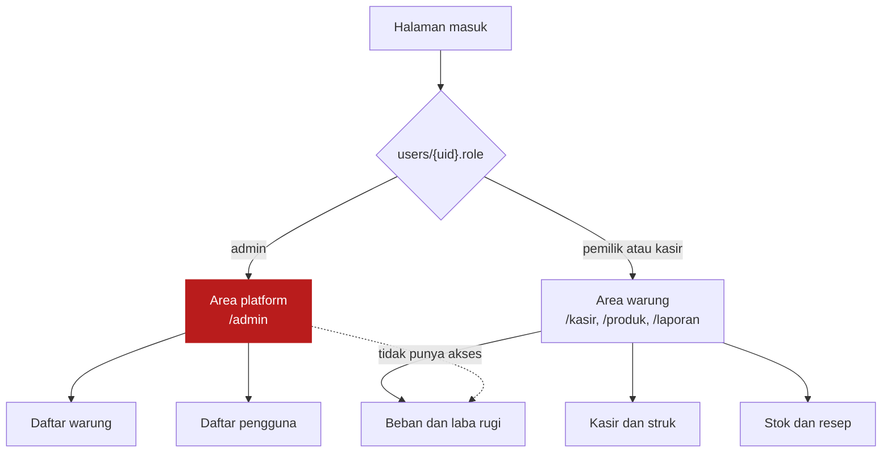
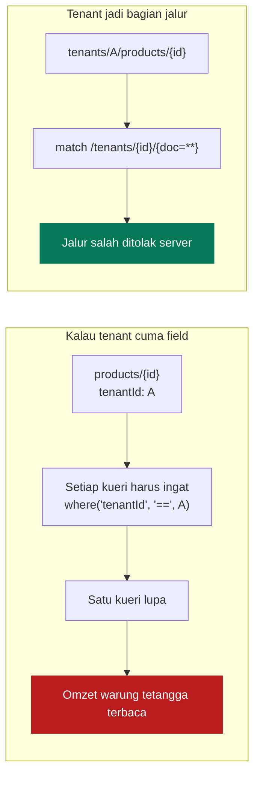
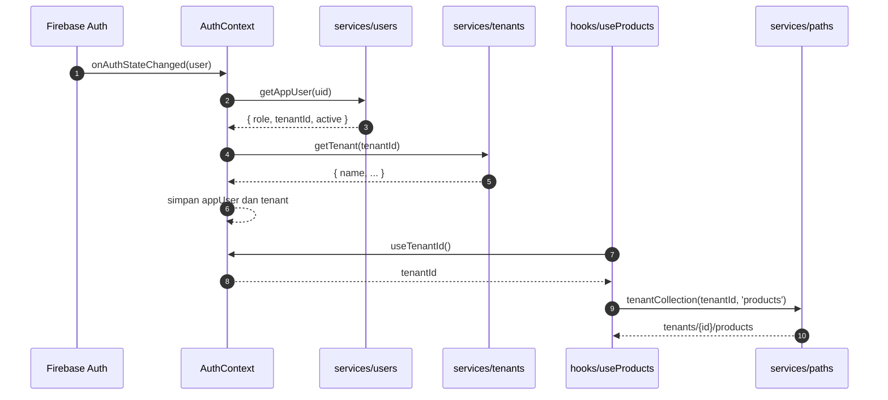
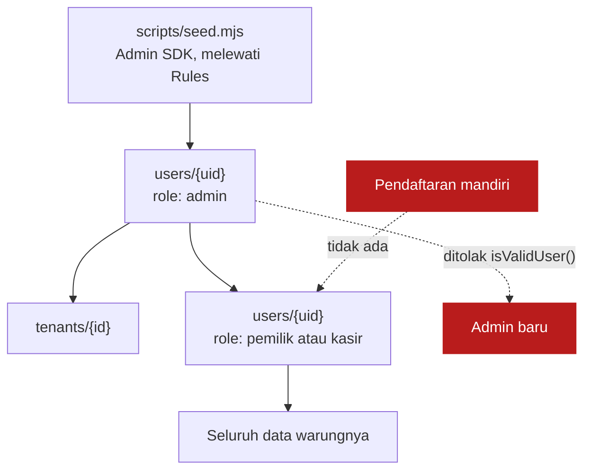
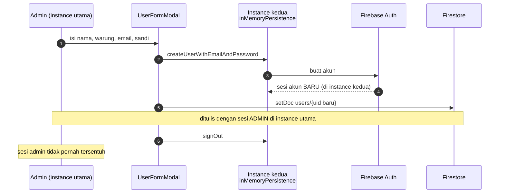
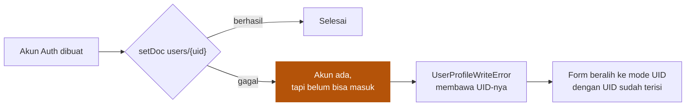
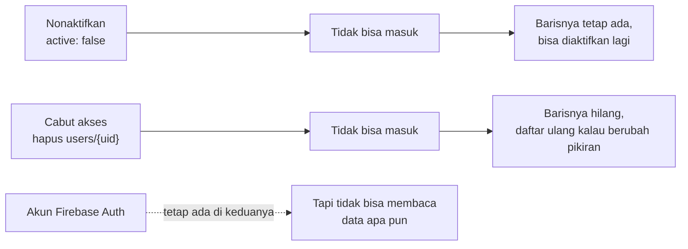

# Multi Warung

[← Kembali ke indeks](./README.md)

Satu pemasangan aplikasi ini melayani banyak warung. Dokumen ini menjelaskan
bagaimana warung dipisahkan, siapa yang boleh membuat siapa, dan kenapa
bentuknya begitu. Hampir semua keputusan lain di proyek ini mengikuti dari sini.

## Dua dunia



Keduanya memakai kerangka yang sama, `AppShell`, tetapi tidak pernah melihat
halaman satu sama lain. Pemisahannya di tingkat rute lewat `RequireAdmin` dan
`RequireTenantUser`, bukan dengan menyembunyikan menu.

**Kenapa begitu.** Menyembunyikan menu hanya mengubah tampilan. Yang menegakkan
batas sebenarnya adalah `firestore.rules`: admin yang memaksa membuka `/laporan`
tetap tidak mendapat satu angka pun, karena aturannya menolak permintaannya di
server.

## Tenant sebagai jalur, bukan field

Ini keputusan tunggal yang paling menentukan keamanan seluruh layanan.



Kalau tenant hanya berupa field di dalam dokumen, keamanan bergantung pada
setiap kueri di seluruh kode ingat menyertakan filternya, selamanya, termasuk
kueri yang ditulis orang lain setahun dari sekarang. Kalau tenant jadi bagian
dari jalur dokumen, tidak ada kueri yang **bisa** lupa: jalurnya sendiri yang
menentukan warung mana yang dibaca.

Jalur dirakit di satu tempat, [`src/services/paths.ts`](../src/services/paths.ts),
yang menolak `tenantId` kosong dengan pesan yang jelas alih alih diam diam
membentuk `tenants//products`.

```
users/{uid}
tenants/{tenantId}
tenants/{tenantId}/products/{id}
tenants/{tenantId}/recipes/{id}
tenants/{tenantId}/productions/{id}
tenants/{tenantId}/sales/{id}
tenants/{tenantId}/expenses/{id}
```

## Bagaimana tenantId sampai ke kueri



Hook mengambil `tenantId` sendiri dari context, bukan menerimanya dari halaman.
Akibatnya halaman tidak perlu tahu apa apa soal tenant, dan tidak ada halaman
yang bisa lupa mengoper warungnya lalu diam diam membaca warung lain.

`tenantId` dibaca dari dokumen pengguna **di sisi server** oleh Security Rules,
bukan dari apa pun yang dikirim browser, jadi tidak ada cara memalsukannya.

## Siapa membuat siapa



Rantainya punya satu awal yang berada di luar aplikasi, dan itu disengaja.
Validator `isValidUser()` di `firestore.rules` hanya menerima peran `pemilik`
dan `kasir`, sehingga tidak ada jalan bagi siapa pun, termasuk admin yang sudah
ada, mengangkat admin baru dari dalam aplikasi. Admin baru hanya lahir dari
skrip yang memakai kunci service account.

## Mendaftarkan pengguna tanpa kehilangan sesi sendiri

`createUserWithEmailAndPassword` dan `confirmationResult.confirm` sama sama ikut
me-login akun yang baru dibuat. Itu perilaku Firebase, bukan kekeliruan.



Tanpa instance kedua, admin yang mendaftarkan pemilik warung akan langsung
terlempar keluar dan berganti jadi orang itu, di tengah halaman yang sedang
dibukanya. Sesinya dipasang `inMemoryPersistence` supaya tidak ada sesi
menggantung milik orang lain di perangkat admin.

### Tiga cara mendaftarkan

| Cara | Kapan dipakai | Kenapa ada |
| --- | --- | --- |
| Nomor HP | Pemilik warung yang tidak punya email | Paling mudah diingat orangnya |
| Email | Akun yang kata sandinya diberikan admin | Bisa dibuat sepihak, tanpa OTP |
| UID | Akun yang sudah pernah masuk, misalnya lewat Google | Satu satunya cara untuk akun Google |

Nomor HP tidak bisa didaftarkan sepihak: OTP-nya dikirim ke HP orangnya, dan itu
berlaku dengan atau tanpa backend. Jadi alurnya memang dirancang berdua, admin
mengetik nomornya lalu pemilik warung membacakan kodenya.

Akun Google tidak bisa dibuatkan sama sekali. UID-nya baru ada setelah orangnya
sign-in sekali, dan halaman masuk menampilkan UID itu saat menolaknya, supaya
bisa langsung dikirim ke admin.

### Kalau langkah kedua gagal



Keadaan setengah jadi ini tidak disembunyikan. Kalau disembunyikan, admin akan
mencoba mendaftar ulang dengan email yang sama dan ditolak Firebase karena
emailnya sudah terpakai, tanpa penjelasan.

## Sesi, dan kenapa tidak ada PIN

Persistensi auth dipasang IndexedDB dengan localStorage sebagai cadangan.
Refresh token Firebase **tidak punya masa berlaku**: selama tidak menekan
Keluar, tidak mengganti kredensial, dan akunnya tidak dinonaktifkan, orangnya
tidak akan pernah diminta masuk lagi di perangkat yang sama.

Itu memang tujuannya. Masuk lewat OTP setiap membuka aplikasi terlalu
merepotkan untuk warung, dan pemilik warung bukan orang yang terbiasa mengetik
kata sandi panjang setiap pagi.

**Kenapa tidak ada PIN.** Tanpa backend, PIN tidak mungkin ditukar menjadi sesi
Firebase: tidak ada yang bisa menandatangani token dari sebuah PIN. Jadi PIN
hanya bisa jadi gembok layar di atas sesi yang sudah hidup, bukan faktor
autentikasi kedua. Kalau nanti ditambahkan, sadari batas itu sejak awal dan
jangan menjualnya sebagai keamanan.

## Mencabut akses



Klien tidak bisa menghapus akun Firebase Auth milik orang lain tanpa Admin SDK,
jadi yang dicabut selalu barisnya di `users`, bukan akunnya. Efeknya sama:
tanpa baris itu, `isActive()` di Security Rules bernilai salah dan seluruh
koleksi menolak.

Riwayat transaksi tidak terpengaruh keduanya, karena setiap struk menyimpan
salinan nama kasirnya sendiri.

## Yang belum dilakukan

| Belum ada | Konsekuensi |
| --- | --- |
| Satu akun untuk beberapa warung | Orang yang mengelola dua warung butuh dua akun |
| Admin membuat admin lain | Admin baru hanya lewat `scripts/seed.mjs` |
| Menghapus warung dari aplikasi | Firestore tidak menghapus subkoleksi berjenjang; pakai skrip |
| Hak akses berbeda antara pemilik dan kasir | Peran disimpan dan ditampilkan, tapi belum membatasi apa pun |
| Admin melihat ringkasan usaha tiap warung | Butuh dokumen ringkasan terpisah, karena admin sengaja tidak boleh membaca subkoleksinya |

Empat yang pertama tinggal ditambahkan kalau dibutuhkan. Yang terakhir sengaja
tidak dilakukan dengan cara memberi admin akses baca: satu akun admin yang bocor
tidak boleh berarti seluruh pembukuan semua warung ikut terbuka.
