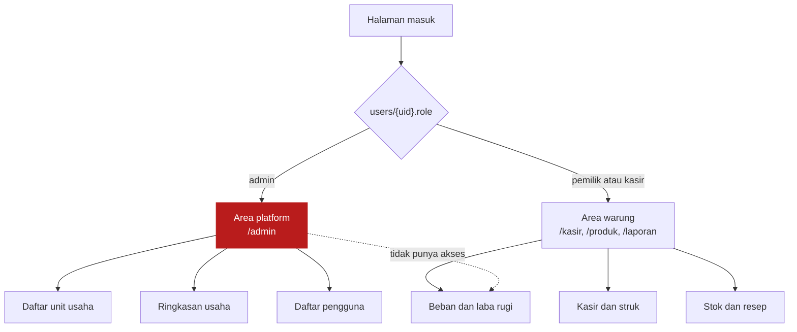
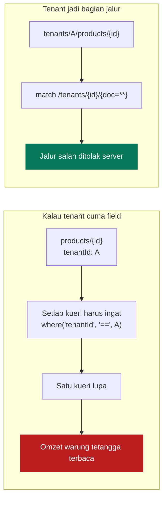
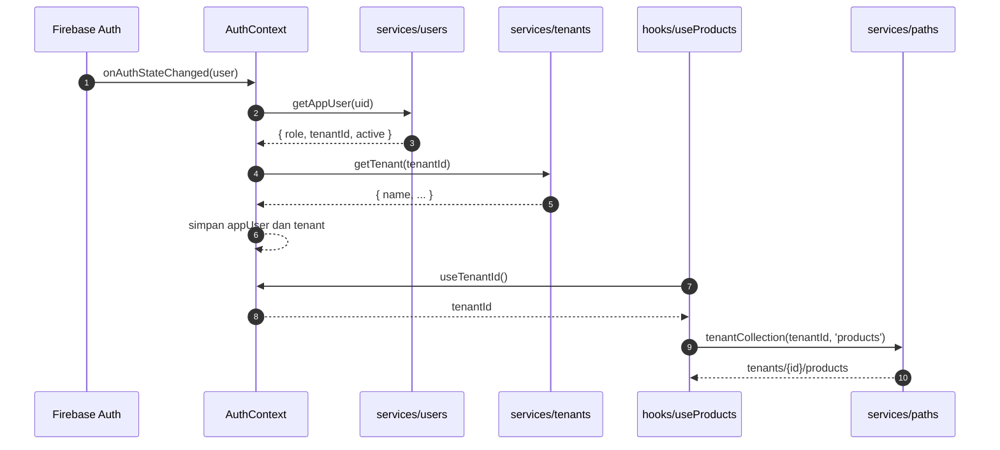
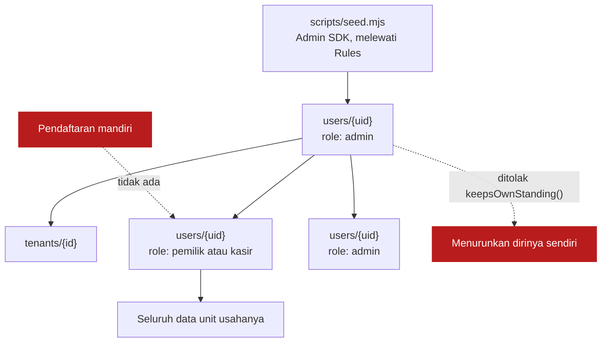
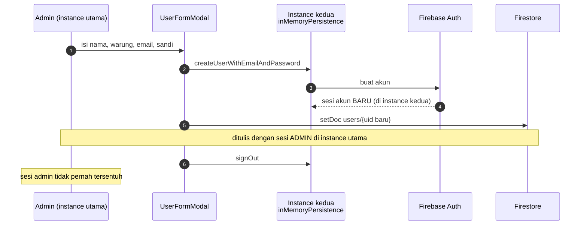
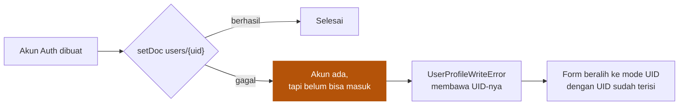
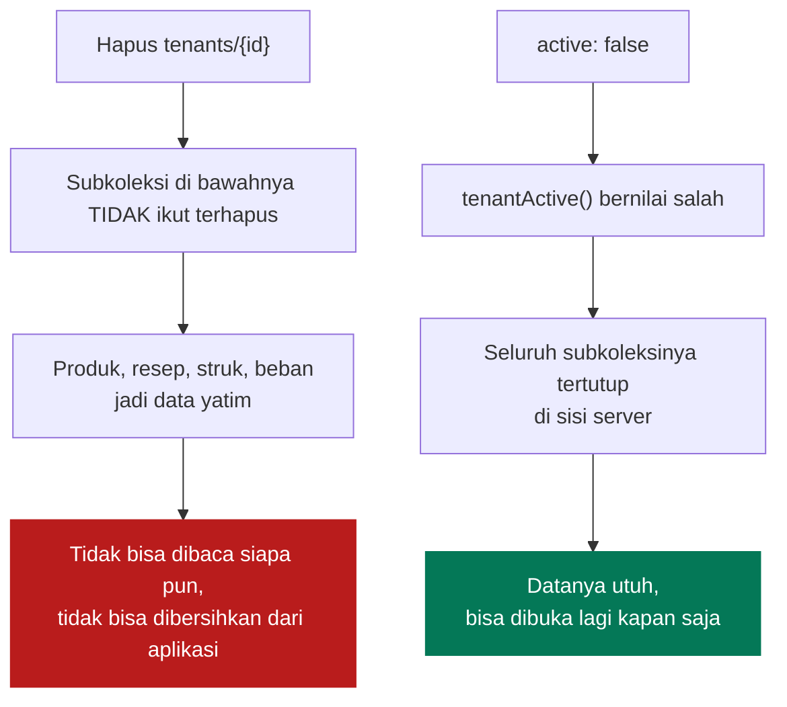
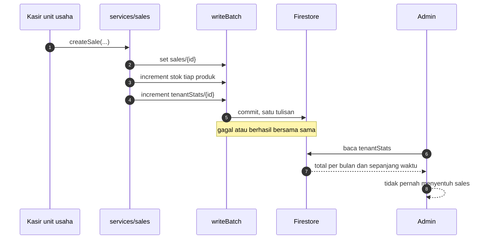
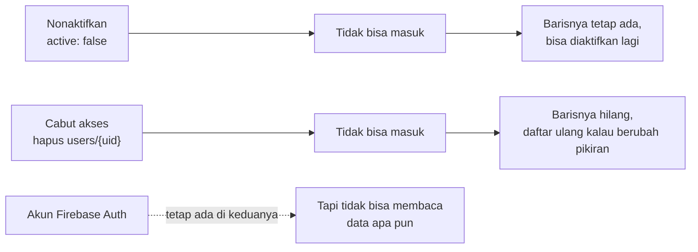

# Multi Warung

[← Kembali ke indeks](./README.md)

Satu pemasangan aplikasi ini melayani banyak warung. Dokumen ini menjelaskan
bagaimana warung dipisahkan, siapa yang boleh membuat siapa, dan kenapa
bentuknya begitu. Hampir semua keputusan lain di proyek ini mengikuti dari sini.

## Dua dunia



Keduanya memakai kerangka yang sama, `AppShell`, tetapi tidak pernah melihat
halaman satu sama lain. Pemisahannya di tingkat rute lewat `RequireAdmin` dan
`RequireTenantUser`, bukan dengan menyembunyikan menu.

**Kenapa begitu.** Menyembunyikan menu hanya mengubah tampilan. Yang menegakkan
batas sebenarnya adalah `firestore.rules`: admin yang memaksa membuka `/laporan`
tetap tidak mendapat satu angka pun, karena aturannya menolak permintaannya di
server.

## Tenant sebagai jalur, bukan field

Ini keputusan tunggal yang paling menentukan keamanan seluruh layanan.



Kalau tenant hanya berupa field di dalam dokumen, keamanan bergantung pada
setiap kueri di seluruh kode ingat menyertakan filternya, selamanya, termasuk
kueri yang ditulis orang lain setahun dari sekarang. Kalau tenant jadi bagian
dari jalur dokumen, tidak ada kueri yang **bisa** lupa: jalurnya sendiri yang
menentukan warung mana yang dibaca.

Jalur dirakit di satu tempat, [`src/services/paths.ts`](../src/services/paths.ts),
yang menolak `tenantId` kosong dengan pesan yang jelas alih alih diam diam
membentuk `tenants//products`.

```
users/{uid}
tenants/{tenantId}
tenantStats/{tenantId}
tenants/{tenantId}/products/{id}
tenants/{tenantId}/recipes/{id}
tenants/{tenantId}/productions/{id}
tenants/{tenantId}/sales/{id}
tenants/{tenantId}/expenses/{id}
```

## Bagaimana tenantId sampai ke kueri



Hook mengambil `tenantId` sendiri dari context, bukan menerimanya dari halaman.
Akibatnya halaman tidak perlu tahu apa apa soal tenant, dan tidak ada halaman
yang bisa lupa mengoper warungnya lalu diam diam membaca warung lain.

`tenantId` dibaca dari dokumen pengguna **di sisi server** oleh Security Rules,
bukan dari apa pun yang dikirim browser, jadi tidak ada cara memalsukannya.

## Siapa membuat siapa



Rantainya punya satu awal yang berada di luar aplikasi, dan itu disengaja: admin
pertama hanya lahir dari skrip yang memakai kunci service account. Sesudahnya
admin boleh mengangkat admin lain dari dalam aplikasi.

`isValidUser()` memeriksa peran dan bentuk barisnya bersama sama, supaya tidak
ada baris setengah jadi:

| Peran | `tenantId` |
| --- | --- |
| `pemilik`, `kasir` | wajib terisi |
| `admin` | wajib kosong |

`keepsOwnStanding()` melarang siapa pun menurunkan peran atau menonaktifkan
**dirinya sendiri**. Tanpa itu satu salah klik bisa menghapus admin terakhir
platform, dan tidak ada cara memulihkannya dari dalam aplikasi. Nama sendiri
tetap boleh diubah.

**Yang ditukar.** Sebelumnya `isValidUser()` menolak peran `admin` sepenuhnya,
sehingga satu akun admin yang bocor pun tidak bisa mencetak admin baru. Sekarang
bisa, jadi mengusir admin yang bocor berarti mencabut juga semua yang dibuatnya.
Yang **tidak** berubah: orang yang belum terdaftar tetap tidak punya pijakan
apa pun, karena seluruh tulisan ke `users` menuntut `isAdmin()` lebih dulu.

## Mendaftarkan pengguna tanpa kehilangan sesi sendiri

`createUserWithEmailAndPassword` dan `confirmationResult.confirm` sama sama ikut
me-login akun yang baru dibuat. Itu perilaku Firebase, bukan kekeliruan.



Tanpa instance kedua, admin yang mendaftarkan pemilik warung akan langsung
terlempar keluar dan berganti jadi orang itu, di tengah halaman yang sedang
dibukanya. Sesinya dipasang `inMemoryPersistence` supaya tidak ada sesi
menggantung milik orang lain di perangkat admin.

### Dua cara mendaftarkan

| Cara | Kapan dipakai | Yang terjadi |
| --- | --- | --- |
| Email | Akun yang kata sandinya diberikan admin | Akun dan barisnya dibuat langsung |
| UID | Akun yang sudah pernah masuk, misalnya lewat Google | Barisnya saja yang dibuat |

Akun Google tidak bisa dibuatkan sama sekali. UID-nya baru ada setelah orangnya
sign-in sekali, dan halaman masuk menampilkan UID itu saat menolaknya, supaya
bisa langsung dikirim ke admin.

### Nomor HP pernah jadi cara ketiga

Dulu ada jalur undangan: admin menuliskan nomor HP, orangnya masuk sendiri lewat
OTP, dan barisnya lahir saat itu juga. Itu satu satunya tempat seseorang menulis
barisnya sendiri di `users`, dijaga aturan yang membaca undangan berdasarkan
nomor di tokennya.

Dicabut bersama login nomor HP. OTP menuntut reCAPTCHA, dan reCAPTCHA menuntut
satu langkah lagi dari orang yang sedang membuka kasir. Koleksi `invites` dan
cabang pendaftaran mandiri di aturan `users` ikut dihapus, bukan ditinggalkan
mati: aturan yang tidak mungkin terpicu tapi tetap mengizinkan seseorang menulis
barisnya sendiri hanya menyesatkan pembaca berikutnya tentang apa yang dijaga.

Kalau dikembalikan, kembalikan keduanya sekaligus. Riwayatnya utuh di git.

### Unit usaha tidak dipilihkan otomatis

Form pendaftaran dulu memakai unit usaha pertama menurut abjad sebagai bawaan.
Akibatnya admin yang tidak memperhatikan dropdown memasukkan orang ke unit yang
salah tanpa satu pun tanda, dan salah tempat seperti itu baru ketahuan setelah
orangnya membuka pembukuan yang bukan miliknya.

Sekarang unitnya kosong sampai dipilih, kecuali kalau memang tidak ada yang
ambigu: hanya ada satu unit usaha, atau formnya dibuka dari baris unit tertentu
di halaman Unit Usaha.

### Kalau langkah kedua gagal



Keadaan setengah jadi ini tidak disembunyikan. Kalau disembunyikan, admin akan
mencoba mendaftar ulang dengan email yang sama dan ditolak Firebase karena
emailnya sudah terpakai, tanpa penjelasan.

## Sesi, dan kenapa tidak ada PIN

Persistensi auth dipasang IndexedDB dengan localStorage sebagai cadangan.
Refresh token Firebase **tidak punya masa berlaku**: selama tidak menekan
Keluar, tidak mengganti kredensial, dan akunnya tidak dinonaktifkan, orangnya
tidak akan pernah diminta masuk lagi di perangkat yang sama.

Itu memang tujuannya. Mengetik kata sandi setiap membuka aplikasi terlalu
merepotkan untuk warung, dan pemilik unit usaha bukan orang yang terbiasa
melakukannya setiap pagi.

**Kenapa tidak ada PIN.** Tanpa backend, PIN tidak mungkin ditukar menjadi sesi
Firebase: tidak ada yang bisa menandatangani token dari sebuah PIN. Jadi PIN
hanya bisa jadi gembok layar di atas sesi yang sudah hidup, bukan faktor
autentikasi kedua. Kalau nanti ditambahkan, sadari batas itu sejak awal dan
jangan menjualnya sebagai keamanan.

## Menonaktifkan unit usaha

Unit usaha tidak bisa dihapus dari aplikasi, dan itu disengaja.



Firestore tidak mengenal penghapusan berjenjang, dan klien tidak punya cara
murah untuk menyapu subkoleksi. Menonaktifkan menutup aksesnya tanpa menyentuh
satu dokumen pun di dalamnya.

**Membaca dokumen unit usahanya sendiri sengaja tidak ikut diperiksa status
aktifnya.** Kalau ikut, orang dari unit usaha yang baru dinonaktifkan akan
mendapat `permission-denied`, dan aplikasi membacanya sebagai gangguan jaringan,
bukan sebagai "unit usaha ini sedang ditutup". Yang dijaga status aktif adalah
datanya, di subkoleksi bawah.

## Ringkasan usaha untuk admin

Admin tidak boleh membaca struk unit usaha mana pun, tapi tetap perlu tahu unit
mana yang jalan dan berapa hasilnya. Jembatannya adalah `tenantStats/{tenantId}`.



Ditulis dengan `increment`, sehingga dua perangkat yang menjual bersamaan tetap
menghasilkan total yang benar, dan ikut mengantre di cache lokal saat unit usaha
sedang offline, sama seperti transaksinya.

Bulan diambil dari **tanggal transaksinya**, bukan hari ini. Struk bulan lalu
yang dibatalkan hari ini mengurangi bulan lalu, dan beban yang tanggalnya
dipindahkan dari Juli ke Agustus mengurangi Juli sekaligus menambah Agustus.

**Batas ketelitiannya disebutkan langsung di halamannya.** Angka itu persis
sepercaya catatan yang mendasarinya, tidak lebih: unit usaha sudah memegang penuh
catatan penjualannya sendiri, jadi ringkasan ini tidak menuntut kepercayaan baru.
Ia bukan alat audit, dan tidak boleh dijual sebagai itu.

## Mencabut akses



Klien tidak bisa menghapus akun Firebase Auth milik orang lain tanpa Admin SDK,
jadi yang dicabut selalu barisnya di `users`, bukan akunnya. Efeknya sama:
tanpa baris itu, `isActive()` di Security Rules bernilai salah dan seluruh
koleksi menolak.

Riwayat transaksi tidak terpengaruh keduanya, karena setiap struk menyimpan
salinan nama kasirnya sendiri.

## Yang belum dilakukan

| Belum ada | Konsekuensi |
| --- | --- |
| Satu akun untuk beberapa unit usaha | Orang yang mengelola dua unit butuh dua akun |
| Menghapus unit usaha dari aplikasi | Diganti penonaktifan; penghapusan sungguhan butuh skrip |
| Hak akses berbeda antara pemilik dan kasir | Peran disimpan dan ditampilkan, tapi belum membatasi apa pun |
| Rincian transaksi untuk admin | Sengaja tidak ada. Yang tersedia hanya total lewat `tenantStats` |
| Membangun ulang `tenantStats` dari struk | Ringkasan yang terlanjur melenceng hanya bisa dikoreksi lewat skrip Admin SDK |

Baris keempat sengaja dibiarkan: memberi admin akses baca ke subkoleksi akan
membatalkan jaminan bahwa satu akun admin yang bocor tidak membuka pembukuan
semua unit usaha. Sisanya tinggal ditambahkan kalau dibutuhkan.
