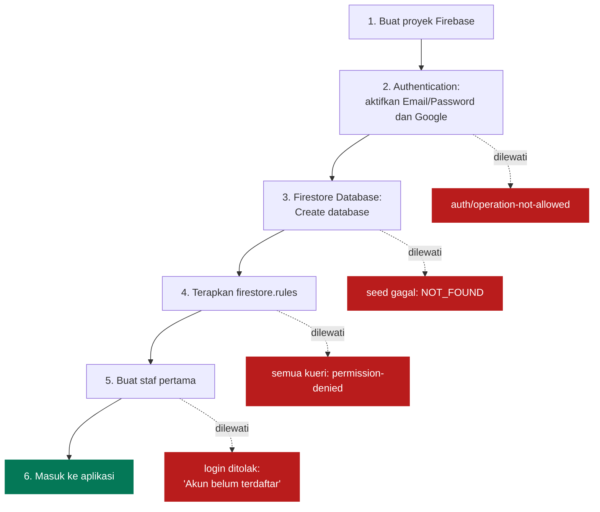
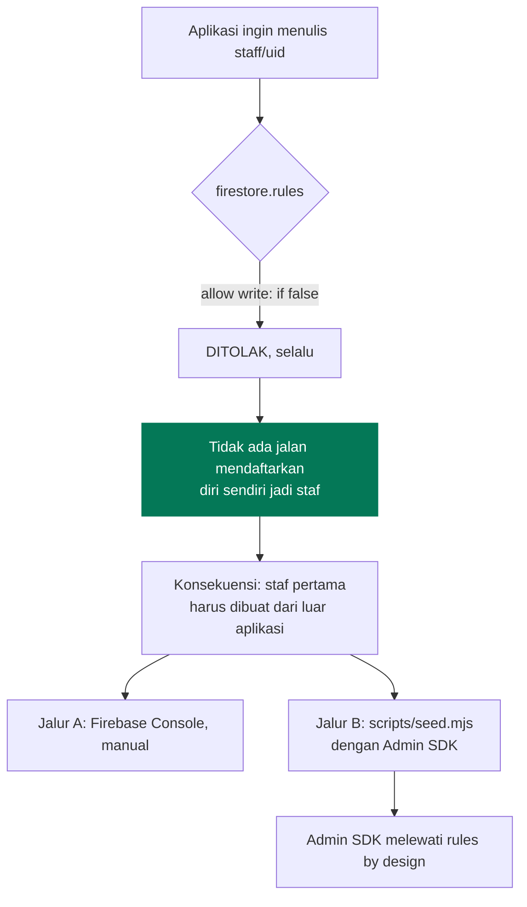
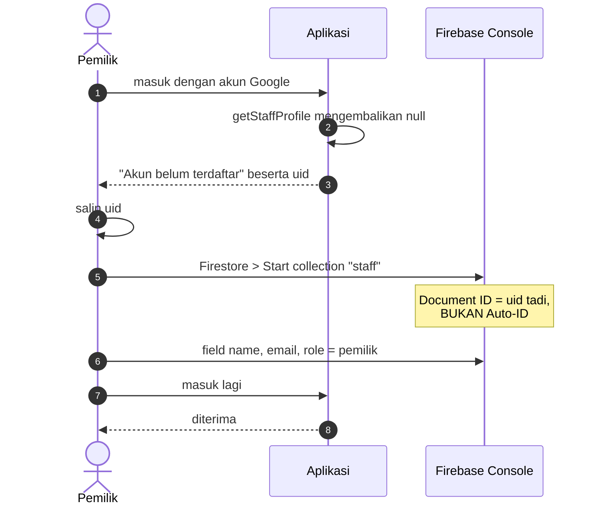
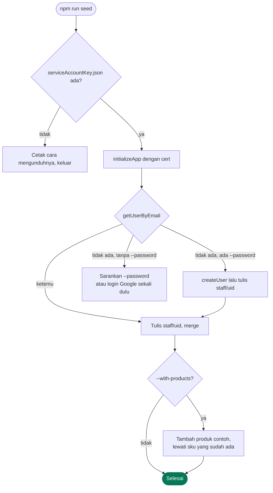
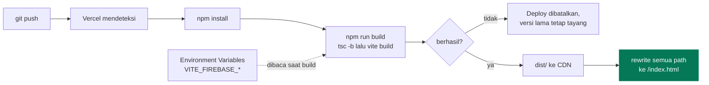
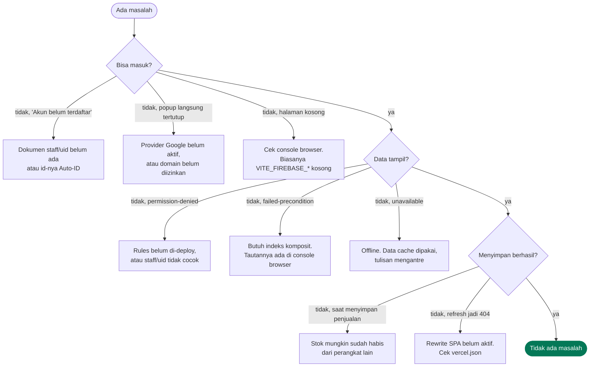

# Operasional

[← Kembali ke indeks](./README.md)

Menyiapkan, menjalankan, dan merawat. Untuk langkah pertama kali yang lebih
ringkas, lihat [`../README.md`](../README.md).

## Urutan penyiapan

Urutannya penting. Melompati langkah membuat langkah berikutnya gagal dengan
pesan yang membingungkan.



## Menerapkan Security Rules

Rules **tidak ikut ter-deploy lewat Vercel**. Ini jalur terpisah.

```bash
npx -y firebase-tools login
npx -y firebase-tools use simple-pos-kkn-agung
npx -y firebase-tools deploy --only firestore:rules
```

Alternatif tanpa CLI: Firebase Console > Firestore Database > Rules, hapus
seluruh isinya, tempel isi `firestore.rules`, lalu **Publish**.

Verifikasi dengan Rules Playground seperti dijelaskan di
[Keamanan](./keamanan.md#memverifikasi-aturan-sudah-terpasang).

## Mengisi data awal

Koleksi Firestore tercipta sendiri saat dokumen pertamanya ditulis, jadi tidak
ada yang perlu dibuat manual kecuali `staff`.

| Koleksi | Dibuat oleh | Kapan |
| --- | --- | --- |
| `staff` | `scripts/seed.mjs` atau Console | wajib, sebelum bisa masuk |
| `products` | halaman Produk & Stok | produk pertama ditambahkan |
| `sales` | layar Kasir | transaksi pertama diselesaikan |
| `expenses` | halaman Beban Operasional | beban pertama dicatat |

### Kenapa staf pertama butuh perkakas terpisah



### Jalur A, manual lewat Console



Kesalahan paling sering di langkah ini: memakai **Auto-ID** untuk dokumen. Id
dokumen harus sama persis dengan uid, karena Security Rules mencarinya lewat
`request.auth.uid`.

### Jalur B, dengan skrip

Ambil kunci di Firebase Console > Project settings > Service accounts >
Generate new private key, simpan sebagai `serviceAccountKey.json` di akar proyek.

```bash
# staf pertama, sekaligus membuat akun email/password
npm run seed -- --email pemilik@toko.id --password rahasia123 --name "Bu Sri"

# menambah kasir
npm run seed -- --email kasir@toko.id --role kasir --name "Andi"

# sekalian isi sepuluh produk contoh
npm run seed -- --email pemilik@toko.id --with-products

# semua pilihan
npm run seed -- --help
```



Sifat skripnya:

- **Idempoten.** Dokumen staf ditimpa dengan merge, produk dilewati kalau
  sku-nya sudah ada. Aman dijalankan berulang.
- **Tidak pernah menulis ke `sales`.** Penjualan palsu akan merusak laporan laba
  rugi yang sebenarnya.
- **Pesan errornya berupa instruksi**, bukan stack trace. Empat penyebab yang
  ditangani khusus: kunci rusak, database belum dibuat, service account tanpa
  izin, dan kata sandi di bawah enam karakter.

## Deploy ke Vercel



**Variabel lingkungan dibaca saat build, bukan saat dijalankan.** Mengubahnya di
dasbor Vercel tidak berpengaruh sampai ada deploy ulang.

Isi variabel ini di Vercel sesuai `.env.example`:

```
VITE_FIREBASE_API_KEY
VITE_FIREBASE_AUTH_DOMAIN
VITE_FIREBASE_PROJECT_ID
VITE_FIREBASE_STORAGE_BUCKET
VITE_FIREBASE_MESSAGING_SENDER_ID
VITE_FIREBASE_APP_ID
VITE_STORE_NAME
```

`vercel.json` sudah mengatur rewrite SPA. Tanpa itu, menyegarkan halaman di
`/laporan` akan menghasilkan 404 karena tidak ada berkas dengan nama itu.

### Setelah deploy pertama

Tambahkan domain Vercel ke **Firebase Console > Authentication > Settings >
Authorized domains**. Kalau tidak, login Google gagal dengan
`auth/unauthorized-domain` walaupun di localhost berjalan lancar.

## Penelusuran masalah



### Tabel kode error

| Kode | Arti | Perbaikan |
| --- | --- | --- |
| `permission-denied` | Rules menolak | Cek dokumen `staff/{uid}`, pastikan rules sudah di-deploy |
| `unavailable` | Tidak bisa menghubungi server | Normal saat offline, data cache dipakai |
| `failed-precondition` | Indeks belum ada | Buka tautan di console browser, lalu catat di `firestore.indexes.json` |
| `resource-exhausted` | Kuota harian habis | Tunggu reset, atau naikkan paket Firebase |
| `auth/unauthorized-domain` | Domain belum terdaftar | Authorized domains di Console |
| `auth/operation-not-allowed` | Provider belum aktif | Sign-in method di Console |
| `NOT_FOUND` saat seed | Database Firestore belum dibuat | Create database di Console |

## Perawatan rutin

| Kegiatan | Frekuensi | Cara |
| --- | --- | --- |
| Perbarui dependensi | Triwulan | `npm outdated`, naikkan bertahap, `npm run build` tiap langkah |
| Audit keamanan | Tiap perubahan dependensi | `npm audit --omit=dev` harus bersih |
| Cabut akses staf keluar | Saat terjadi | Hapus dokumen `staff/{uid}` |
| Cadangkan data | Bulanan | Console > Firestore > Import/Export, atau unduh CSV dari halaman Laba Rugi |
| Tinjau ulang rules | Tiap menambah koleksi | Koleksi baru tanpa aturan otomatis ditolak, itu perilaku yang benar |

### Catatan dependensi

`firebase-admin` adalah devDependency dan **tidak pernah ikut ke bundel
browser**. Ia membawa peringatan transitif `uuid` lewat `@google-cloud/storage`.
Karena itu pemeriksaan yang berlaku adalah:

```bash
npm audit --omit=dev   # harus 0 vulnerabilities
```

## Perintah

| Perintah | Fungsi |
| --- | --- |
| `npm run dev` | Server pengembangan |
| `npm run build` | Type check lalu build produksi |
| `npm run preview` | Meninjau hasil build secara lokal |
| `npm run lint` | oxlint |
| `npm run seed -- --help` | Pilihan skrip pengisi data awal |

`npm run build` menjalankan `tsc -b` lebih dulu, jadi kesalahan tipe menggagalkan
build. Ini disengaja: aplikasi yang mengurus uang dan stok tidak boleh tayang
dengan tipe yang salah.
