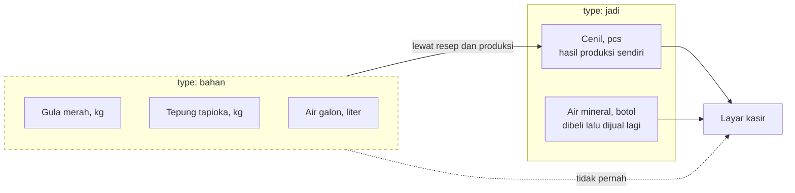
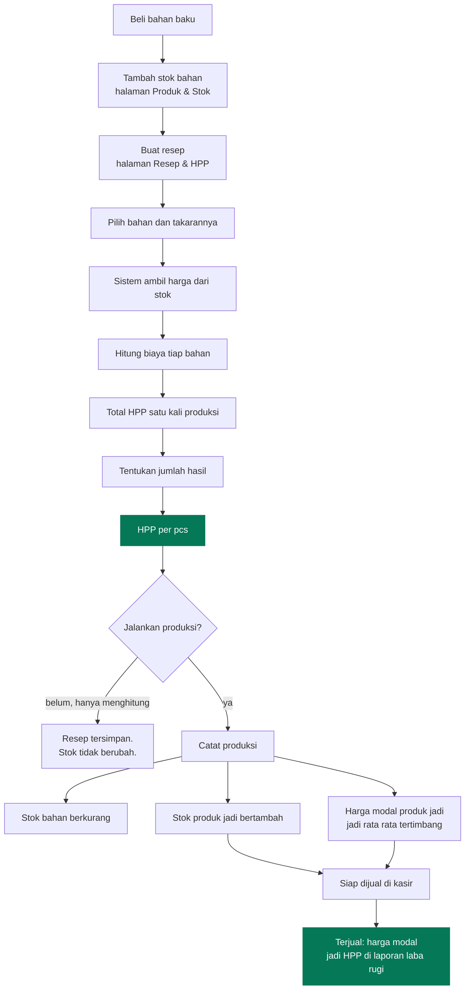
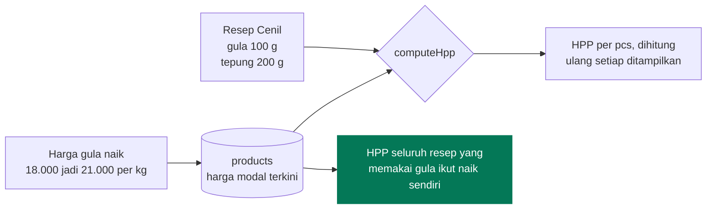
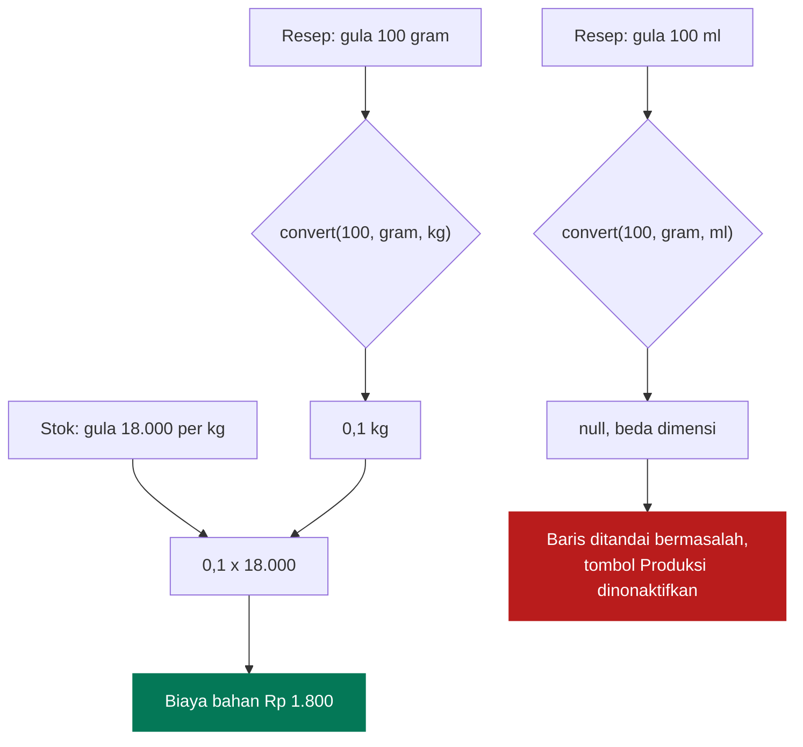
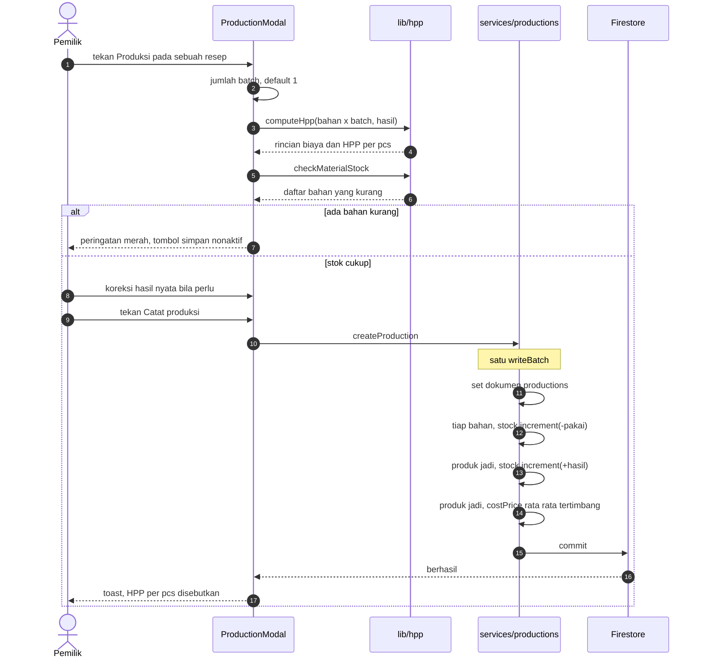
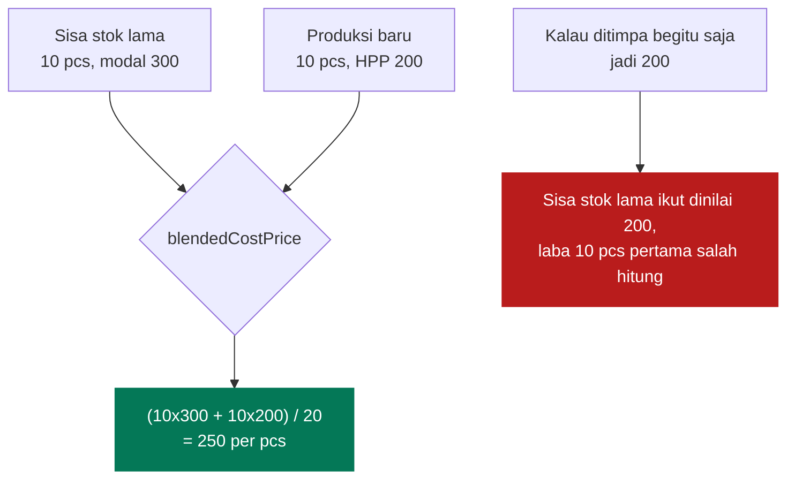
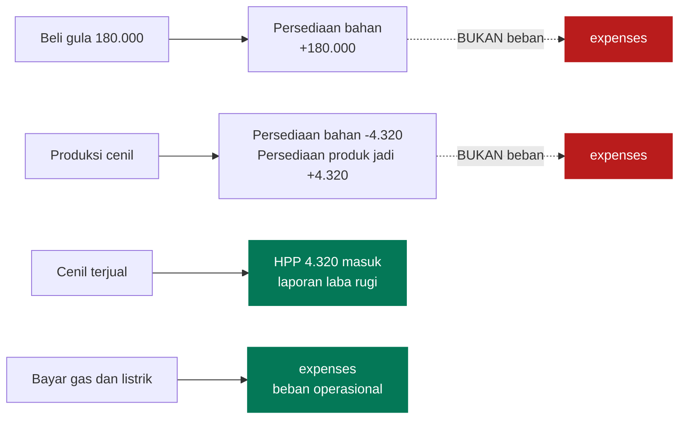
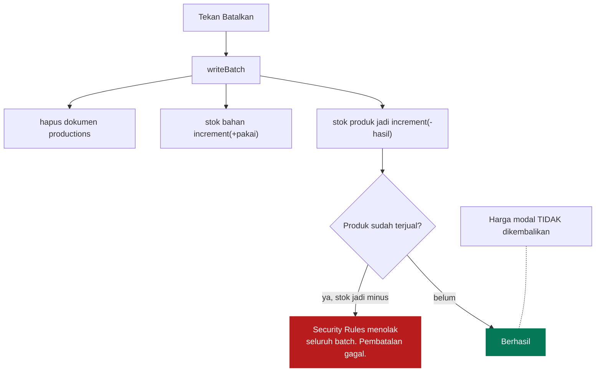
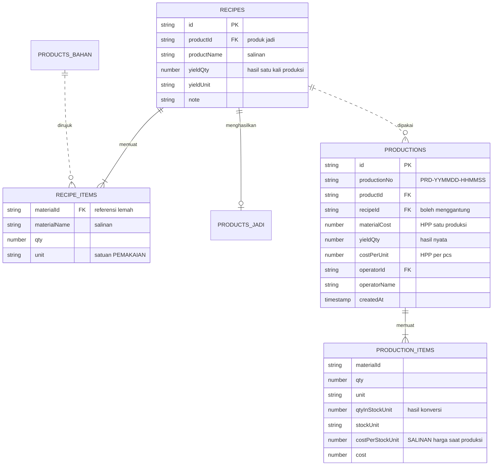

# Produksi dan HPP

[← Kembali ke indeks](./README.md)

Bagian ini untuk usaha yang **membuat** barangnya sendiri, bukan sekadar
menjualnya kembali. Gula merah, tepung, dan air bukan barang dagangan: ia bahan
yang berubah wujud jadi cenil atau klepon, dan harga pokok satu pcs-nya baru
bisa diketahui dengan menelusuri resepnya.

## Dua jenis produk

| | `bahan` | `jadi` |
| --- | --- | --- |
| Muncul di kasir | tidak | ya |
| Punya harga jual | tidak | ya |
| Harga modal | dari harga beli | dari harga beli, atau dari HPP produksi |
| Dipakai resep | ya | tidak |

**Dokumen lama tidak perlu dimigrasi.** Produk yang dibuat sebelum fitur ini ada
tidak punya field `type`, dan `mapProduct` membacanya sebagai `jadi`, karena
dulu memang hanya jenis itu yang ada.

## Alur lengkap

Cabang `K` penting: **menyimpan resep tidak menyentuh stok sama sekali.** Resep
adalah alat hitung. Stok baru bergerak ketika produksi benar benar dicatat.

## Kenapa resep tidak menyimpan harga

Resep hanya menyimpan **bahan apa** dan **berapa banyak**. Harganya tidak ikut
disimpan sedikit pun.

Itulah gunanya. Kalau harga disalin ke dalam resep, setiap kenaikan harga
kulakan menuntut pemilik membuka satu per satu resepnya dan memperbarui angka
secara manual, dan HPP akan pelan pelan jadi salah tanpa ada yang sadar.

**Riwayat produksi sebaliknya menyimpan harga**, karena HPP yang sudah terjadi
tidak boleh berubah. Ini pola yang sama persis dengan baris penjualan yang
menyimpan salinan harganya sendiri.

## Konversi satuan

Resep menulis gram, stok dibeli per kilo. Tanpa konversi, biaya bahan meleset
seribu kali lipat.

Tiga dimensi, konversi hanya boleh di dalam dimensi yang sama:

| Dimensi | Satuan dasar | Satuan lain |
| --- | --- | --- |
| berat | gram | ons (100), kg (1000) |
| volume | ml | liter (1000) |
| jumlah | pcs | bungkus, botol, sachet, kotak, karung, porsi, lusin (12) |

**Gram tidak bisa jadi mililiter.** 100 ml air dan 100 ml minyak beratnya
berbeda, dan aplikasi ini tidak menyimpan massa jenis. `convert` mengembalikan
`null` alih alih menebak, dan pemanggilnya wajib menangani kasus itu.

Untuk bahan bersatuan jumlah, hanya satuannya sendiri yang ditawarkan: mengubah
botol jadi sachet tidak punya arti apa apa.

## Contoh perhitungan

Resep Cenil, menghasilkan 20 pcs.

| Bahan | Pemakaian | Satuan stok | Harga modal | Konversi | Biaya |
| --- | --- | --- | --- | --- | --- |
| Gula merah | 100 gram | kg | 18.000 / kg | 0,1 kg | 1.800 |
| Tepung tapioka | 200 gram | kg | 12.000 / kg | 0,2 kg | 2.400 |
| Air galon | 100 ml | liter | 1.200 / liter | 0,1 liter | 120 |
| | | | | **HPP produksi** | **4.320** |
| | | | | **HPP per pcs** | **216** |

Kalau harga jual Cenil 1.500 per pcs, labanya 1.284 per pcs dengan margin 86%.
Angka itu tampil langsung di daftar resep, jadi keputusan harga tidak perlu
menunggu akhir bulan.

**Pembulatan dilakukan per baris**, bukan sekali di akhir. Dengan begitu total
yang tampil sama persis dengan hasil menjumlahkan angka tiap barisnya secara
manual, dan tidak ada selisih satu dua rupiah yang bikin bingung.

## Menjalankan produksi

### Jumlah batch dan hasil nyata dipisah

Dapur tidak selalu menghasilkan persis seperti resep. Karena itu ada dua kolom:

- **Jumlah batch** menskalakan pemakaian bahan.
- **Hasil nyata** diisi apa adanya, sesuai hitungan fisik.

HPP per pcs dibagi dengan hasil nyata, bukan hasil teoretis. Kalau satu batch
seharusnya jadi 20 pcs tapi nyatanya cuma 18 karena ada yang gagal, HPP per
pcs-nya memang naik, dan laporan harus jujur soal itu.

## Rata rata tertimbang harga modal

Kalau stok produk jadi sedang nol, rata ratanya sama saja dengan HPP produksi
terbaru, dan inilah keadaan yang paling sering terjadi.

## Produksi bukan beban

Ini kelanjutan langsung dari aturan yang sudah berlaku di
[Akuntansi](./akuntansi.md#kapan-modal-barang-diakui).

Produksi hanya **memindahkan nilai** dari satu persediaan ke persediaan lain.
Total nilai persediaan tidak berubah sedikit pun. Modal baru diakui sebagai HPP
ketika produknya terjual.

Mencatat produksi sebagai beban akan menghitung modal dua kali, persis kesalahan
yang sama seperti mencatat pembelian stok sebagai beban.

> **Yang belum termasuk.** HPP di sini adalah **biaya bahan baku saja**. Tenaga
> kerja, gas, dan listrik tidak ikut dibebankan ke produk, melainkan dicatat di
> Beban Operasional sehingga memotong laba bersih satu kali. Untuk perhitungan
> harga pokok penuh, biaya biaya itu perlu ikut diserap ke dalam HPP, dan itu
> belum tersedia.

## Membatalkan produksi

Dokumen produksi tidak bisa diedit, sama seperti dokumen penjualan. Koreksi
dilakukan dengan membatalkan.

Dua batasan yang perlu diketahui:

1. **Harga modal tidak dikembalikan ke nilai sebelumnya.** Rata rata tertimbang
   tidak bisa dibalik tanpa menyimpan riwayat nilainya. Kalau ini penting,
   perbaiki harga modalnya lewat form produk.
2. **Pembatalan gagal kalau produknya sudah terjual**, karena stok jadi negatif
   dan aturan menolaknya. Itu memang pencegahan yang benar: barang yang sudah
   berpindah ke pembeli tidak bisa dianggap tidak pernah diproduksi.

## Model data

Perhatikan bedanya: `RECIPE_ITEMS` tidak punya field harga sama sekali,
sementara `PRODUCTION_ITEMS` menyimpan `costPerStockUnit`. Itu bukan
ketidakkonsistenan, itu justru inti rancangannya.

## Aturan keamanan

| Koleksi | read | create | update | delete |
| --- | --- | --- | --- | --- |
| `recipes` | staf | staf + validasi | staf + validasi | staf |
| `productions` | staf | staf + validasi + `operatorId == uid` | **tidak pernah** | staf |

`productions` tidak bisa diedit dengan alasan yang sama seperti `sales`: HPP
historis tidak boleh diubah diam diam.

## Kalau bahan dihapus

`materialId` adalah referensi lemah, sama seperti `productId` pada baris
penjualan. Ia boleh menunjuk dokumen yang sudah tidak ada.

| Tempat | Perilaku |
| --- | --- |
| Daftar resep | Baris ditandai "perlu diperbaiki", tombol Produksi dinonaktifkan |
| Form resep | Baris memberi pesan "Bahan sudah dihapus dari daftar produk" |
| Riwayat produksi | Tetap utuh, karena menyimpan salinan nama dan harganya |
| Membatalkan produksi | Bahan yang hilang dilewati, sisanya tetap dikembalikan |

Total HPP resep yang punya baris bermasalah **tidak boleh dipercaya**, dan
karena itu produksinya dicegah, bukan sekadar diberi peringatan.
